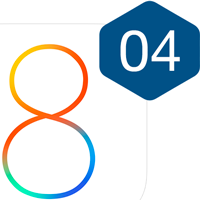
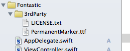
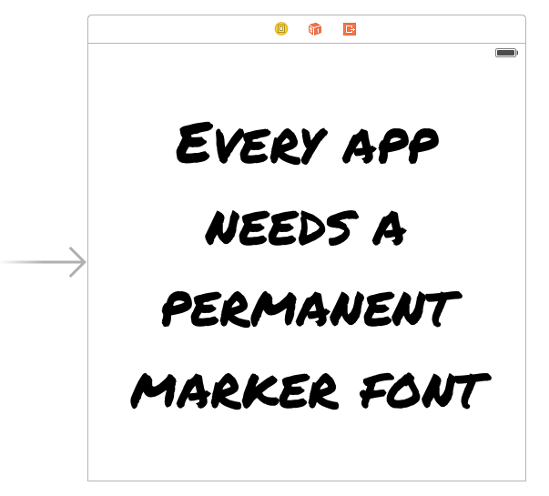

# Day 4 :: Custom Fonts in Interface Builder

{width=10%,float=left}

It is not unreasonable to want to use custom fonts in your apps, and it has been
possible to do so for a while on iOS. However, it has always been troublesome
designing the UI in Interface Builder, since you have to build your interface
with the system font. The resulted in building and running your app repeatedly
to get the desired result.

Well, Xcode 6 finally changes this! Now, any custom fonts present in your app's
bundle will be available in Interface Builder, and will render as they would
look in your running. This will be a noticeable jump in productivity, and you'll
learn how easy it is to use in today's day-by-day article.

There isn't really any source _code_ associated with today's post, but there is
a project which demonstrates the functionality. The code is available on github
at [github.com/ShinobiControls/iOS8-day-by-day](https://github.com/ShinobiControls/iOS8-day-by-day).

## Font availability within Interface Builder

Interface Builder is able to pick up any fonts that are part of your app's bundle,
and the easiest way to ensure this is to drag your __ttf__ or __otf__ file from
the finder into the app:

Then, you'll be able to select this font using the attributes inspector in Xcode,
when editing a __xib__ or __storyboard__ file:

This will then update the appearance of the view appropriately in Interface
Builder:

This is great, but if you run your app up now, then you'll very quickly realise
that it's not a completely happy story:

## Declaring fonts for use within your app

The reason that your font isn't being picked up at runtime, is because although
Interface Builder is able to pick up any fonts in the bundle, you still have to
declare them in the plist (as before) in order to use them.

This is as simple as opening up the app's __Info.plist__ file, either directly
from the project navigator, or using the __Info__ tab of the target's settings
page, and adding the font:

You can run your app up again now, and this time you'll see it working!

## Conclusion

Today's was quite a short chapter, but it represents a fix in Interface Builder which
has been niggling at developers for a long time. I think that the little bits
and pieces like this that Apple has been working on within the developer toolset
demonstrates their commitment to making the process much more friendly.

As ever, the demo project is available on github at
[github.com/ShinobiControls/iOS8-day-by-day](https://github.com/ShinobiControls/iOS8-day-by-day).
