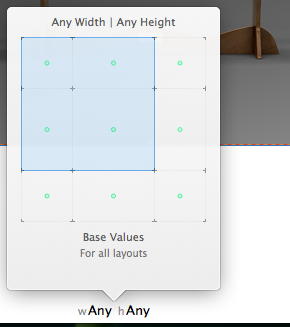
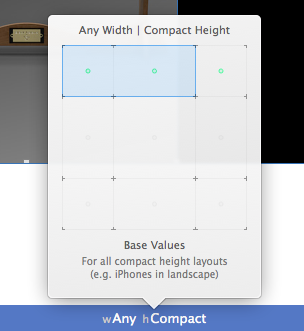
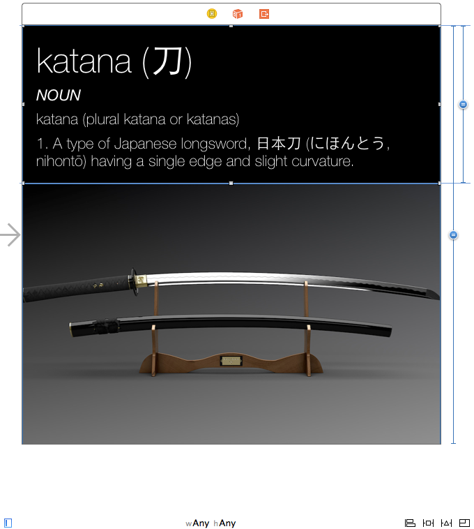
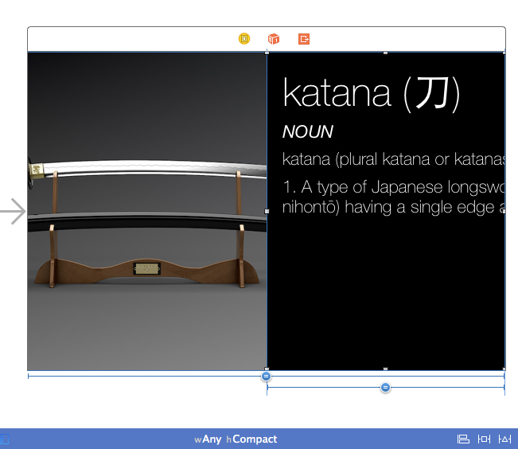
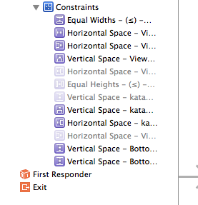
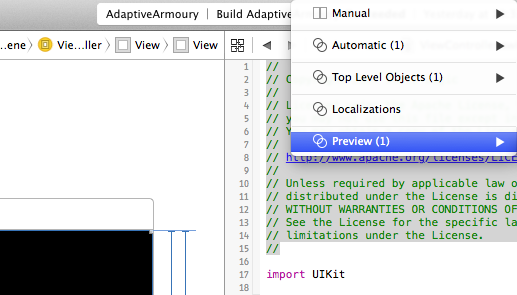
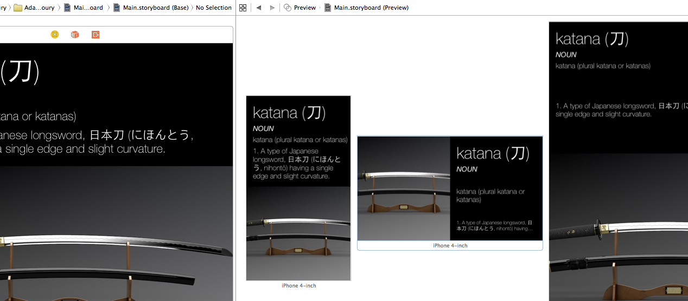
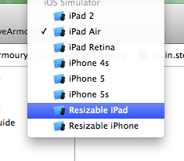
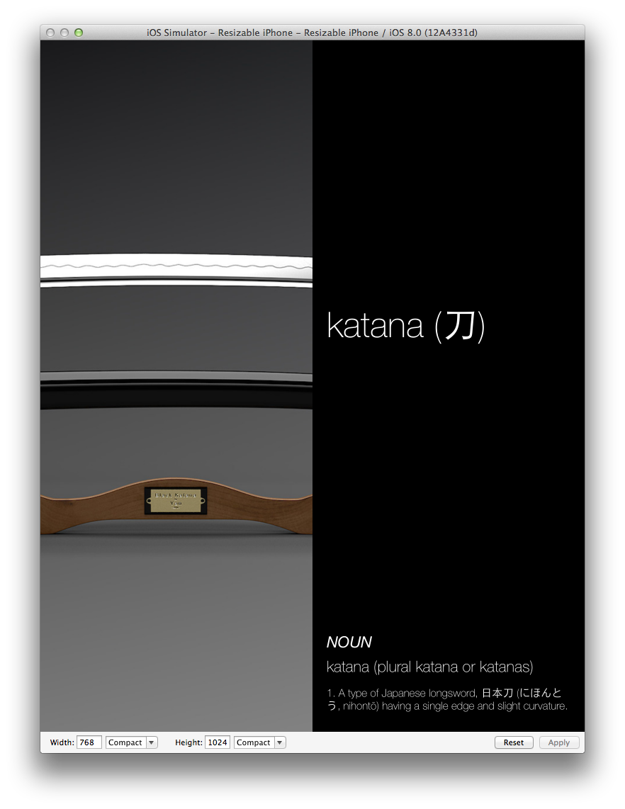
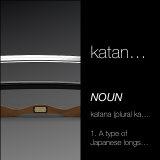

# Day 7 :: Adaptive Layout and UITraitCollection

Adaptive UI is probably the most important concept to be introduced in iOS8. It
might not seem like it at first, but abstracting the UI away from dependencies
on things like device and orientation, allows closer concentration on the design
itself, and less on the mechanics of implementation.

The most significant aspect to adaptive UI in iOS8 is adaptive layout - that is
layout which can automatically change depending on particular characteristics
of the container.

This leads on to having universal storyboards - i.e. a single storyboard which
can be used on multiple devices. This might well make storyboards an even more
attractive proposition.

Today's post will give a quick introduction to adaptive layout in iOS8. The
accompanying project demonstrates a universal storyboard, with varying layouts.
It's available as part of the github repo at
[github.com/shinobicontrols/iOS8-day-by-day](https://github.com/ShinobiControls/iOS8-day-by-day).

## Adaptive Layout

iOS8 introduces the concept of __size classes__ - which are used to categorise
the amount of space in a particular dimension. There are 2 possible classes - 
__Regular__ and __Compact__. Every view has particular size classes associated
with them via a __TraitCollection__. By default these are defined by the device,
but they can be overriden. A view can then customise it's view according to its
size classes. The classes and their use on different devices are outlined below:

|                  | Vertical Size Class | Horizontal Size Class |
|------------------|:-------------------:|:---------------------:|
| iPad Portrait    | Regular             | Regular               |
| iPad Landscape   | Regular             | Regular               |
| iPhone Portrait  | Regular             | Compact               |
| iPhone Landscape | Compact             | Compact               |

The key thing to consider here is that when designing layouts, you don't _have_
to specify a size class - i.e. you might create a generic layout, and then override
a few bits of the layout for the compact vertical size class.

Because of these size classes you are able to use just one universal storyboard
for both iPad and iPhone layouts - removing an entire category of errors caused
by mistakes in copying between the two storyboards.

Interface builder in Xcode 6 makes this process really rather easy to follow, with
the new trait override selector. This can be found in the bar at the bottom of the
view and allows you to specify exactly which size class combination your design
is currently for.

The process for creating adaptive layouts should be as follows:

1. Start by creating the generic layout. This should be the base layout - the one
from which the other layouts inherit - they are specializations of this layout -
not completely independent.
2. Implement your layout specializations in the _least_ constricting override
class.

The key to this is thinking less in terms of devices, and more in terms of the
layout itself.

When you specify a size class override in IB then you'll see the bottom bar
turn blue:

You are then able to add or remove layout constraints, and even (un)install views
to configure a specific layout for this size class.

For example, the following is a screenshot from the accompanying project, in the
'base values' mode:

and here for horizontally compact classes:

You can see that the layout has changed, with the picture moving to the left
rather than being at the bottom. You should also spot that the sizes of the views
on the storyboard don't relate to the devices. This is to encourage you to move
away from thinking of pixel-perfect device appearance, and more towards the concept
of generalized layout.

Removing layout constraints for particular size class overrides is known as
uninstalling them - and can be done by pressing delete whilst the constraint is
selected. The view of constraints in the document navigator shows both the
installed and uninstalled constraints:

You can view all the constraints which affect a particular view in the size
inspector, with an option to see all constraints, or just those for the current
size class:

That's pretty much all you actually need to know in order to get started with
adaptive layout. The key thing to remember is to think in terms of generalized
layout, and not specifics for different devices.

## Xcode Assistance

This approach can seem a little daunting at first, but Xcode 6 has some helpful
features to ease your transition to the new way of thinking. The first is a new
assistant view which will show you what your layout looks like on different
devices, without having to run the project up on a simulator.

You access the preview by opening an assistant editor, and then selecting the
preview from the jump bar:

Once there you can add preview for different devices, and rotate them to your
chosen orientation:

The views in the preview will update as you change the layouts in the storyboard.

The other new addition to your toolkit is resizable simulators - these are simply
simulators for which you can specify both point sizes and size classes. These
are accessible from the list of simulators in the same way as the standard
device simulators:

You can then see how your design works at a multitude of different resolutions
and size classes. The following show a simulator running at different resolutions,
but with both horizontal and vertical size classes set to 'compact'.

## Conclusion

The technologies behind adaptive layout aren't actually that complicated. It
involves you rethinking how your design works. If you haven't already embraced
the world of autolayout, then now is the time to get onboard. The introduction of
adaptive layout should be a strong indication that in the future we'll be designing
for more device configurations than the three we're currently used to. Attempting
to scale up the existing device specific approach will not be achievable - therefore
implying that autolayout is going to become a requirement.

You should definitely spend some time becoming acquainted with IB in Xcode 6 - it
offers a lot of improvements over previous versions.

The project which accompanies today's post demonstrates setting up a simple
adaptive layout project using storyboards - and you can grab it from the
ShinobiControls github at
[github.com/ShinobiControls/iOS8-day-by-day](https://github.com/ShinobiControls/iOS8-day-by-day).

Keep the tweets and comments coming!

sam

