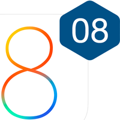
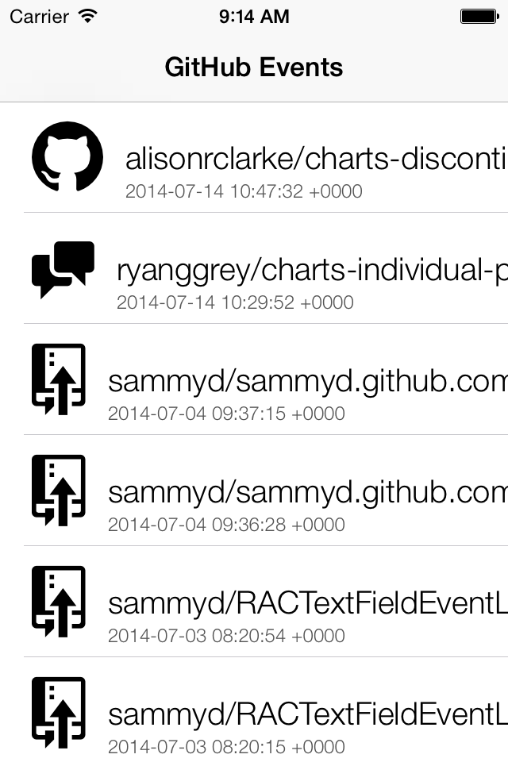
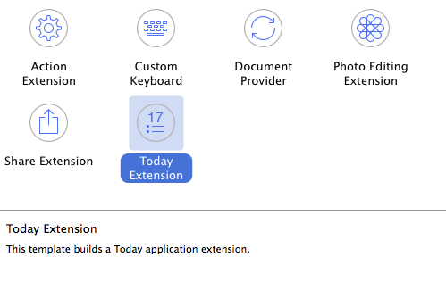
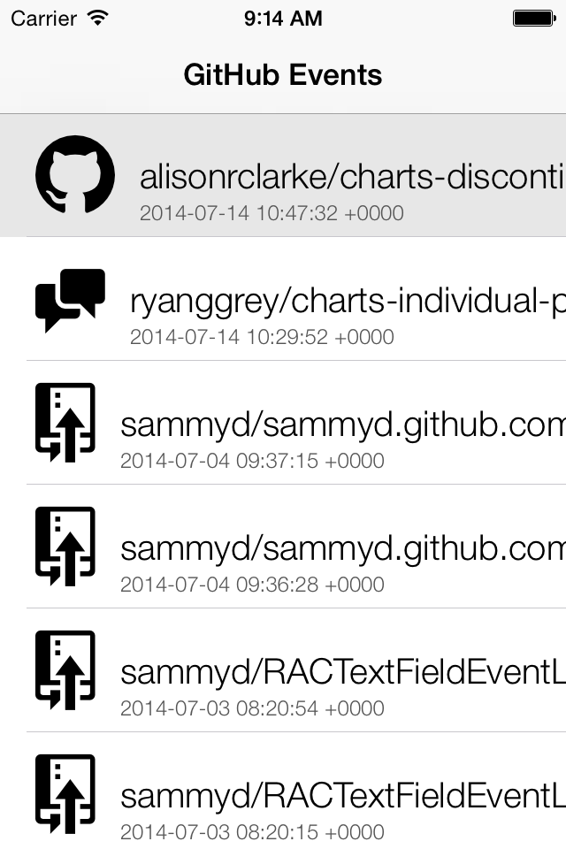

# Day 8 :: Today Extension

{float=left}

Way back in chapter two we took a look at the new sharing extension -
which is just one of six new extension points on iOS. Today, it's the chance of
the today extension, or widget.

Widgets allow you to add content to the today screen on a device. Until iOS8, this
area has been sacred - with only system apps being allowed to display anything
there. This new extension point will allow you to bring small amounts of relevant
info to your users, in an easily accessible fashion.

The project which accompanies this project is based around the Github user public
event feed. The app itself shows the most recent events, and the today widget
shows just the latest event. Throughout this post you'll learn how to create a
today extension, how to share code with the app, how to share cached data with
the app and how to communicate from the widget to the app.

The code for this project is available on Github at
[github.com/ShinobiControls/iO8-day-by-day](https://github.com/ShinobiControls/iOS8-day-by-day).

## Creating a widget

Like all other extensions, widgets have to be distributed as part of a host app
and therefore Xcode provides an extension to add a today extension target to
an existing project. This sets you up with a good foundation for a widget.

At its heart, a widget is just a view controller which gets displayed within the
context of the today overlay. The Xcode template includes a view controller, so
you can kick off by implementing the same things that you normally would within
that.

The Xcode template also includes a storyboard, already wired in, containing a
simple "Hello World" label. If your layout permits, using a storyboard will
allow you to create a layout which works well for a widget. It's certainly worth
using autolayout when designing your layout, as then it will cope well with
different devices.

Part of the difficulty using a storyboard for this design is that in order to
work well with the visual effects used on the today screen, your view should be
transparent. Therefore you can be building a view without really being able to
see it.

By default, a widget has a wide left margin - which will not be part of your
view controller's view. In order to alter this, a new protocol has been
introduced - `NCWidgetProviding`. This contains methods which allow you to
customize both the behavior and the appearance of the widget. One of the
methods on this protocol is `widgetMarginInsetsForProposedMarginInsets()` which
passed you the default margin insets, and allows you to return your own version.
In the __GitHubToday__ sample project, the following override is used:

    func widgetMarginInsetsForProposedMarginInsets(defaultMarginInsets: UIEdgeInsets)
                                                  -> UIEdgeInsets {
      let newInsets = UIEdgeInsets(top: defaultMarginInsets.top,
                                   left: defaultMarginInsets.left-30,
                                   bottom: defaultMarginInsets.bottom,
                                   right: defaultMarginInsets.right)
      return newInsets
    }

This extends the widget 30 points to the left. The design uses this space for
an icon which represents the type of event:

The other method on `NCWidgetProviding` is called by the system to ask whether
there are any updates available for the widget. This allows you to discover
whether there are any updates available, update the layout if necessary, and to
let the system know the result. The method is
`widgetPerformUpdateWithCompletionHandler(completionHandler:)` and you will see
a sample implementation of it from __GitHubToday__ later in the article.

First of all, you need to address a couple of issues, the first being how to
share code between the parent app and the widget.

## Sharing code with the parent app

__GitHubToday__ makes a network request to the Github API, and then parses the
resulting JSON to extract the content it needs to display. This process would
effectively be repeated by the widget as well as the app itself - but copying
the same code between two projects is incredibly inefficient. One option would
be to add the source files to both targets:

This approach will definitely work, but will result in the same functionality
being created in two binaries. Luckily, there's a better way. iOS8 introduces
the concept of a dynamically library, and a widget can use the same library
as the host app. Therefore the best approach is to create a dynamic framework,
and put all the common code in there.

This article is not primarily about dynamic frameworks, so won't go in to detail
about how to create or use them, but once you've created them, you can move
any shared code into it. For example, in __GitHubToday__, the entire model
layer and networking implementation is all packaged into a dynamic framework.
This includes the `GitHubEvent` class, along with `GitHubDataProvider`, which
is used to make the network request itself.

Being able to share code between the app and the widget is really helpful, but
widgets need to be super responsive - setting off a network operation each time
the today screen comes in to view is not going to give the fast, snappy user
experience you desire. In the next section you'll learn how you can improve
upon this by creating a cache which can be shared between the app and the
widget.

## Sharing a cache with the parent app

Since a widget is an extension it's not allowed access to its own disc space,
but it can use a shared container. If you remember back to day 2 of this
series, you learnt how to create a shared container which both an extension and
its host app can write to. There it was only used as a cache for a
`NSURLSession` background task, but you can also use it as a shared cache,
between the app and the widget.

You can obviously store files in this container, so you could create an
SQLite database, or use CoreData, but the simplest approach here is to use
`NSUserDefaults` as a key-value store.

Since the only data that the GitHubToday widget ever needs is the latest event,
then you can store a `GitHubEvent` object in an `NSUserDefaults` file, which
can live in the shared container. When the widget first opens then it can
populate itself from this cached event, and then update the cache (and the
view) when the network operation completes.

The following class (which exists in the common dynamic framework) demonstrates
the behavior of a simple cache:

    let mostRecentEventCacheKey = "GitHubToday.mostRecentEvent"
    public class GitHubEventCache {
      private var userDefaults: NSUserDefaults

      public init(userDefaults: NSUserDefaults) {
        self.userDefaults = userDefaults
      }

      public var mostRecentEvent: GitHubEvent? {
      get {
        if let data = userDefaults.objectForKey(mostRecentEventCacheKey) as? NSData {
          if let event = NSKeyedUnarchiver.unarchiveObjectWithData(data)
                                                                    as? GitHubEvent {
            return event
          }
        }
        return nil
      }
      set {
        if let event = newValue {
          let data = NSKeyedArchiver.archivedDataWithRootObject(event)
          userDefaults.setObject(data, forKey: mostRecentEventCacheKey)
        } else {
          userDefaults.removeObjectForKey(mostRecentEventCacheKey)
        }
      }
      }

    }

If defines a property `mostRecentEvent`, which is pulled from the `userDefaults`
if it exists. It also ensures that the event is pushed back there when it is
updated. It's important that `GitHubEvent` implements the `NSCoding` protocol,
so that the keyed archiver knows how to archive and unarchive it.

The `GitHubEventCache` requires an `NSUserDefaults` object to read and write to.
In order that this can be shared between the app and the extension, this must
be created in the shared container using the `NSUserDefaults(suiteName:)`
initializer:

    let mostRecentEventCache = GitHubEventCache(userDefaults: NSUserDefaults(suiteName: "group.GitHubToday"))

Once you have created a cache in the widget's view controller then you can
use it to populate the view in `viewDidLoad()`:

    let mostRecentEventCache = GitHubEventCache(userDefaults:
                                      NSUserDefaults(suiteName: "group.GitHubToday"))
    var currentEvent: GitHubEvent? {
    didSet {
      dispatch_async(dispatch_get_main_queue()) {
        if let event = self.currentEvent {
          self.typeLabel.text = event.eventType.icon
          self.repoNameLabel.text = event.repoName
        } else {
          self.typeLabel.text = ""
          self.repoNameLabel.text = ""
        }
      }
    }
    }

    override func viewDidLoad() {
      super.viewDidLoad()
      currentEvent = mostRecentEventCache.mostRecentEvent
    }

The system will call the `widgetPerformUpdateWithCompletionHandler()` method
once the widget had been displayed, and at this point you can kick off a network
request to ensure that the latest data is displayed:

    func widgetPerformUpdateWithCompletionHandler(completionHandler:
                                                      ((NCUpdateResult) -> Void)!) {
      dataProvider.getEvents("sammyd", callback: {
        events in
        let newestEvent = events[0]
        if newestEvent != self.currentEvent {
          self.currentEvent = newestEvent
          self.mostRecentEventCache.mostRecentEvent = newestEvent
          completionHandler(.NewData)
        } else {
          completionHandler(.NoData)
        }

        })
    }

Note that here if the latest event you receive from the web service is different
to the one you are currently displaying then you can update the view and then
tell the system that you have new data, by calling
`completionHandler(.NewData)`. If you don't receive new data then you can
instead call `completionHandler(.NoData)`.

Using this caching approach means that you can display the latest data when
appropriate, but also maintain the responsiveness and user experience required
of a today widget.

Obviously this implementation of a cache is incredibly simple - you can build
as much complexity as you want in to the cache. Note that in the main app, when
a network request is completed, the latest result is pushed into the cache,
ensuring that the widget will always start by displaying the most recently
downloaded data, whether it be from the app or the widget itself.

## Navigating back to the parent app

The standard user story for a widget is that a user would look at the summary
and if they want more info, then they can tap the appropriate part of the
widget. In order to achieve this, then you can utilize the existing iOS
URL functionality.

You can define a URL scheme in the __Info__ section of the app's target:

As is standard when defining a URL scheme for an app, you also need to implement
the appropriate method in you app delegate:

    func application(application: UIApplication!, openURL url: NSURL!,
                        sourceApplication: String!, annotation: AnyObject!) -> Bool {
      if let navCtlr = window?.rootViewController as? UINavigationController {
        if let tableCtlr = navCtlr.topViewController as? TableViewController {
          if let eventId = url.lastPathComponent.toInt() {
            tableCtlr.scrollToAndHighlightEvent(eventId)
          }
        }
      }
      return true
    }

This here will attempt to scroll to and highlight the cell in the table view
which represents the event with the given ID.

Now that you've got a URL scheme set up, you can use the `openURL()` method on
the `extensionContext` to link from the widget to the relevant row in the app:

    @IBAction func handleMoreButtonTapped(sender: AnyObject) {
      let url = NSURL(scheme: "githubtoday", host: nil, path: "/\(currentEvent?.id)")
      extensionContext?.openURL(url, completionHandler: nil)
    }

## Conclusion

All the extensions are a really cool new feature of iOS8 - they represent the
beginning of Apple opening up the operating system for devs. The today extension
could be hugely powerful - offering the chance to really improve the user
experience. However, it's important to use it wisely. If there's a massive
influx of mediocre widgets, then users might get annoyed enough not to trust
any. Since they affect a core area of their device usage, widgets need to be
good citizens.

The code for this app and widget is available on github at
[github.com/ShinobiControls/iOS8-day-by-day](https://github.com/ShinobiControls/iOS8-day-by-day).
Feel free to grab it, try it and break it. Do let me know how you get on - I'm
really interested to see what widgets I'm going to be adding to my today
screen in the coming months - I'm [@iwantmyrealname](https://twitter.com/iwantmyrealname)
