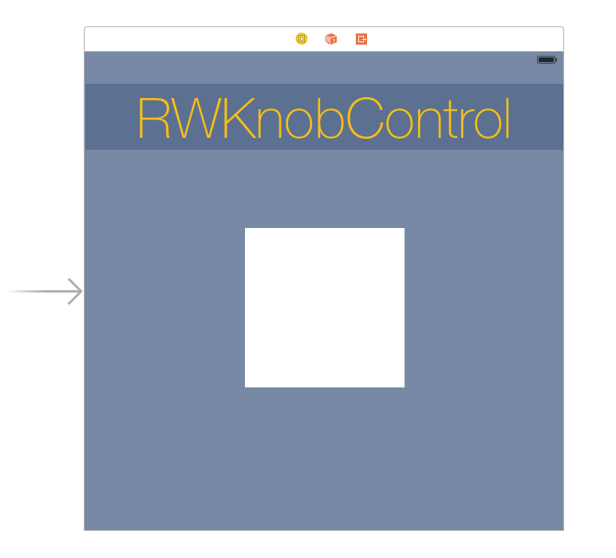
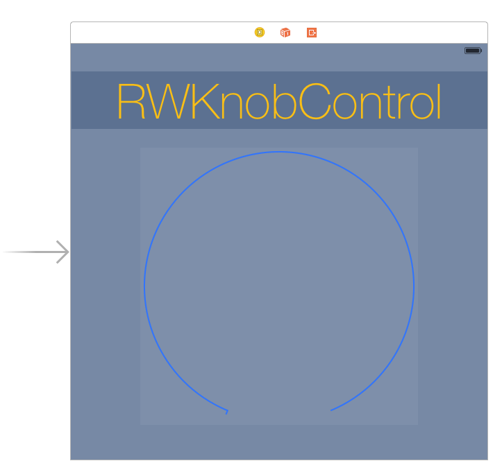
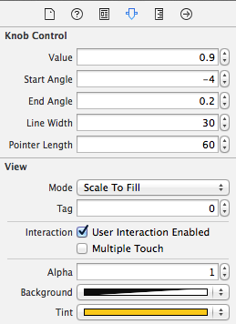
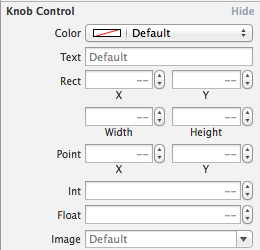
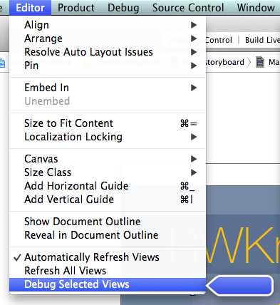

# Day 17 :: Live Rendering in Interface Builder

{width=10%,float=left}

Custom views are a great way of both splitting up your code as a nod towards
software design best practices, but also allowing the creation of reusable
components. I've talked about this concept a lot in terms of building custom
UI Controls - in fact I've given a fair few
[talks](http://iwantmyreal.name/blog/2013/09/18/the-art-of-custom-ui-controls/)
on the subject.

One of the limitations in the iOS world with this technique is that you
instantly lose the ability to work with Interface Builder (IB) in Xcode. Well,
you can continue to use it, but you have to work with a large set of blank
rectangles:

However, this has all changed with Xcode 6, which introduces the concept of
__Live Views__, which are views which appear in IB as they will in the running
app. The exciting news is that they are super easy to use - and you can find out
how today.

The sample project which accompanies this project contains the code from for the
__RWKnobControl__ I created for a tutorial on building custom controls over
on [RayWenderlich.com](http://www.raywenderlich.com/56885/custom-control-for-ios-tutorial-a-reusable-knob).
The code has been translated into Swift, but other than that remains the same.
You can get hold of this project in the iOS 8 day-by-day repo on github at
[github.com/ShinobiControls/iOS8-day-by-day](https://github.com/ShinobiControls/iOS8-day-by-day).

## `@IBDesignable`

The simplicity associated with this new functionality is truly beautiful. Given
that you have a `UIView` subclass, then enabling the live-rendering in IB is as
simple as annotating the class with the `@IBDesignable` annotation:

    @IBDesignable
    class KnobControl : UIControl {
      ...
    }

Now, the view in the storyboard will automatically update to render the live
view:

And that's it! The objective-C equivalent is `IB_DESIGNABLE`.

You can override the `prepareForInterfaceBuilder()` method if you need to provide
any custom setup for the IB view. This will get called only when rendering inside
interface builder.

## `@IBInspectable`

It's all very well and good being able to see the view in interface builder, but
in the knob control example you've just seen it doesn't look too good. The knob
control has a whole set of properties that are used to configure its appearance.
If you annotate these properties with `@IBInspectable` (`IB_INSPECTABLE` in
objective-C) then IB will provide you with config fields in the attributes
inspector to configure them:

    @IBInspectable
    var value:CGFloat {
    get { return self._primitiveValue }
    set { self.setValue(newValue, animated: false) }
    }
    @IBInspectable
    var startAngle:CGFloat {
    get { return self.knobRenderer.startAngle }
    set { self.knobRenderer.startAngle = newValue }
    }
    ...

As you change these values then the view in the storyboard itself will update to
reflect the new settings:

You can edit any types that you are used to using within IB:

    @IBInspectable
    var color: UIColor = UIColor.whiteColor()
    
    @IBInspectable
    var text: String = ""
    
    @IBInspectable
    var rect: CGRect = CGRect.zeroRect
    
    @IBInspectable
    var point: CGPoint = CGPoint.zeroPoint
    
    @IBInspectable
    var int: Int = 0
    
    @IBInspectable
    var float: CGFloat = 0.0

    @IBInspectable
    var image: UIImage = UIImage()

## Debugging Views

So you've managed to get a view which appears inside IB, but maybe it's not
behaving in quite the way you want it. In days gone by you would have thrown in
some breakpoints to your view code, and then run it up in the simulator to debug
it. Obviously you can continue to use this methodology, but the new live views
functionality also offers the ability to debug views right in Interface Builder.

Set up you break points in the usual way, and then select the view in the
storyboard. Use the __Editor > Debug Selected Views__ menu option to kick off
the debug process.

The debug process works in exactly the same way as it does on a device or in the
simulator - so once you've started debugging then changing a value in the
attributes inspector will run exactly the same code you'd expect - and hence hit
any appropriately placed breakpoints.

## Conclusion

This new functionality is really great for anybody who uses custom views and
quite likes using IB for laying out their view controllers. It's so simple to
integrate into your views that there isn't really any excuse not to do it for
views which are fairly simple. Obviously there are many custom views which are
far more complex (and require table views and the suchlike), however the hooks
in to the IB render process might still allow big gains over the iterative
render process that you're used to.

The code for this project is again available in the github repo at
[github.com/ShinobiControls/iOS8-day-by-day](https://github.com/ShinobiControls/iOS8-day-by-day).
