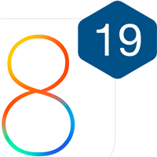
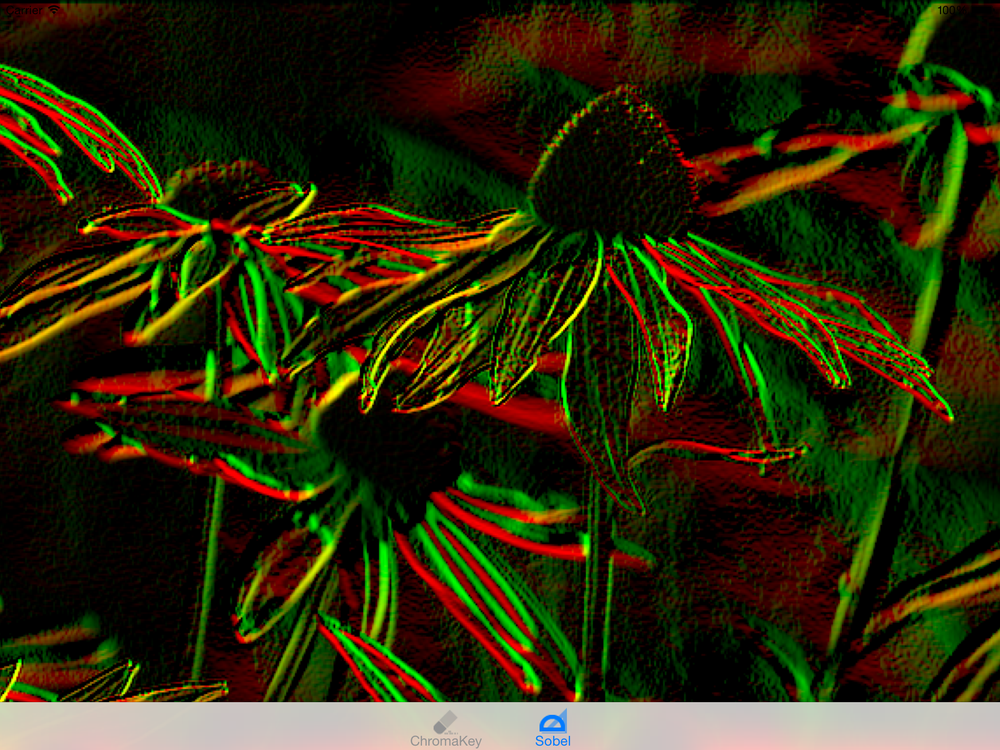

# Day 19 :: CoreImage Kernels

{float=left}

CoreImage regularly pops up in the Day-by-Day series, but is underused in the 
wild, often because it is misunderstood. It provides highly optimized image
processing algorithms, in the form of filters and detectors, which can easily be
chained together in a light-weight processing pipeline.

One of the restrictions with CoreImage on iOS devices has always been that you
are restricted to using the provided filter kernels. This has meant that it is
incredibly difficult to use the GPU to perform any bespoke image processing.
However, iOS8 changes this - with the introduction of custom kernels in
CoreImage.

This post gives a brief introduction into the new custom kernel functionality -
with a couple of examples of creating your own filters. Custom kernels can be
quite complex - they are written in the GLSL language, and represent image
processing algorithms. This article will not attempt to describe either of these
in any detail, but instead discuss the mechanics of creating the kernels and
filters themselves.

The accompanying project is called __FilterBuilder__ and demonstrates building
two different types of CoreImage kernels - one using a color kernel, and one a
general kernel. The source code for this project is available in the repo on
github at [github.com/ShinobiControls/iOS8-day-by-day](http://github.com/ShinobiControls/iOS8-day-by-day).

## Filters and Kernels

In image processing a filter can be thought of as an algorithm which takes a
number of inputs, including an image, and produces an output image. A filter is
a wrapper around a kernel - which is the algorithm which is applied in turn to
every single pixel in the image.

The kernel is the core of the filter, and since it will be run for every single
pixel in the image, it needs to be very efficient. The GPU is very good at
performing the kinds of calculations you require for an image filter, so the
code for the kernel is written in the language which will run directly on the
graphics hardware: GLSL. If you've ever done any work in OpenGLES then you'll
recognize this as the language you've used. In order to preserve platform
independence, then the code is provided as a string and compiled on the device,
at run time. This can make writing the code itself quite hard work, since you
don't get the features you've come to expect from an IDE.

A filter in CoreImage is represented by the `CIFilter` class. These can be
chained together, and provided an input `CIImage`. The output will in turn be
another `CIImage`. One of the great things about this architecture is that it is
incredibly light-weight, and is lazy evaluated. Creating a filter and adding it
to the processing chain will not involve any calculation until the point at
which the output image is required.

iOS comes with 115 built-in image filters available for you to use in your image
processing pipelines, but iOS8 allows you to create your own filters from custom
kernels. These are represented by the `CIKernel` class, which contains a string
of the kernel method itself, written in GLSL.

In the next section you'll learn about the different types of custom kernel, and
see how to create one.

## Custom Kernel Types

Image processing is an area of programming where algorithm optimization often
pays off. This is primarily due to the problem class - you want an incredibly
tight inner loop, since the same kernel will be run for every single pixel in an
image. Therefore CoreImage provides several different subclasses of `CIKernel`
which are highly optimized for a particular class of problem:

- `CIColorKernel` is optimized for the scenario where each output pixel depends
only on the pixel in the same position on the input image. This means that you
can't read pixels from elsewhere in the input. This is ideal for color
transformations, as the name suggests.
- `CIWarpKernel` doesn't change the value of input pixel, but allows you to
choose the location of the output pixel in the input image. This is equivalent
to defining a vector field across the input image, and hence has the effect of
warping the input image to create the output.
- `CIKernel`. The superclass allows you to create a general kernel, for which
you calculate the output pixel value from anywhere within the input image. The
kernel routine itself has access to the entire image.

There are some common concepts across all the different kernel types. They are
all initialized with the same constructor:

    let kernelString = ""
    let kernel = CIColorKernel(string: kernelString)

The kernelString is the string of GLSL which represents the kernel algorithm
itself. Each of the `CIKernel` subclasses has a different way of actually
invoking the kernel, but they all include an `arguments` parameter, which is of
type `[AnyObject]`. This represents the objects which should be passed into the
kernel function at runtime, in the order specified by the kernel function
signature.

All of the kernels have an `extent` parameter, which is a `CGRect`. This, also
known as the domain of the function, specifies the rectangle over which the
kernel should operate. This is required because `CIImage` can have infinite
extent, and there are times when the domain is non-obvious (e.g. compositing
images). Often, this will be the same as the extent of the input image. 

### Color Kernels

A color kernel takes each pixel in an image, and uses it to calculate the value
for the output pixel. Therefore, the (minimum) input for the kernel function is
a single pixel value, and it needs to return a single pixel. You can provide
additional arguments in an array as described above.

In the sample project the chromakey example uses a `CIColorKernel`. The
principle behind chromkeying (commonly known as 'green-screen') is that areas of
a picture which appear green are replaced with a different image. In the
`ChromaKeyKernel` the pixels are set to transparent. The user can provide the
color and a threshold. The following function creates the kernel:

    private func createKernel() -> CIColorKernel {
      let kernelString =
      "kernel vec4 chromaKey( __sample s, __color c, float threshold ) { \n" +
      "  vec4 diff = s.rgba - c;\n" +
      "  float distance = length( diff );\n" +
      "  float alpha = compare( distance - threshold, 0.0, 1.0 );\n" +
      "  return vec4( s.rgb, alpha ); \n" +
      "}"
      return CIColorKernel(string: kernelString)
    }

Some key points:

- The return type is `vec4`, which is a vector of floats of length 4 -
representing RGBA.
- `diff` is the element-wise difference between the supplied color and the
current pixel value
- `distance` is the Euclidean length of the difference vector
- The `compare` function is used to determine whether this pixel is close enough
to the active color or not. It creates an alpha value of `0.0` or `1.0`
- The returned value has the same RGB values as the input pixel, but takes the
calculated `alpha` value.

To use this kernel, it must be wrapped in a custom `CIFilter` subclass. 
`CIFilter` has an `outputImage() -> CIImage?` method which must be overridden,
and will be called when the processing chain requires the filter to be executed.

The following is the implementation of `outputImage()` for `ChromaKeyFilter`:

    func outputImage() -> CIImage? {
      if let inputImage = inputImage {
        let dod = inputImage.extent()
        if let kernel = kernel {
          var args = [inputImage as AnyObject, activeColor as AnyObject, threshold as AnyObject]
          return kernel.applyWithExtent(dod, arguments: args)
        }
      }
      return nil
    }

This uses the method `applyWithExtent(_:, arguments)` on `CIColorKernel` to
return the result. The arguments array is created to match the input
requirements for the aforementioned kernel function. As previously discussed,
the extent here is just the extent of the input image.

This filter can then just be used in the normal way:

    let inputImage = UIImage(named: "chroma_key")
    filter.inputImage = CIImage(image: inputImage)
    filter.activeColor = CIColor(red: 0, green: 1, blue: 0)
    filter.threshold = CGFloat(thresholdSlider.value)
    let outputImage = filter.outputImage
    outputImageView.image = UIImage(CIImage: outputImage)

This has the following results:

### Warp Kernels

Warp kernels don't allow you to change anything about the pixel value itself,
but instead allow you to define which point in the source image it should copy.
This means that a warp kernel will return a `vec2`, representing the coordinates
of the input image that should be sampled for the current output pixel.

The following represents a no-op warp kernel:

    kernel vec2 passThrough () {
      return destCoord();
    }

The major difference between using warp kernels and color kernels is the
addition to the ROI callback in the apply method:

    func applyWithExtent(extent: CGRect, roiCallback callback: CIKernelROICallback!,
              inputImage image: CIImage!, arguments args: [AnyObject]!) -> CIImage!

`CIKernelROICallback` is a closure which will provide a CGRect in the output
image, and require the equivalent rect in the input image. ROI stands for Region
of Interest, and it is used by the filter to determine which part of the input
image needs to be loaded into the graphics hardware to allow processing of a
particular region of the output image. This is in part due to the fact that the
architecture of CoreImage has been updated with iOS8 (and OSX 10.10) to support
processing images much larger than the graphics memory can cope with. Slicing
the image into sections allows efficient use of both the graphics memory and the
processing power of the GPU.

## General Kernels

The final kernel type is a superclass of both `CIColorKernel` and `CIWarpKernel`,
and is known as a general kernel. Whereas both of the subclasses had specific
use cases, the general kernel has no such restrictions. For example, a huge
class of image filters are based on convolution, which neither the color kernel
nor the warp kernel are able to implement. A convolution kernel (such as
Gaussian blur) requires the values of not only the current pixel, but those
surrounding to calculate the value of the output pixel.

As such, a general kernel will output a `vec4`, representing the current pixel
value. You can provide multiple images as input, and they will each be
represented as a `sampler`, from which you can request samples, at different
locations.

In the sample project, there is a general kernel which implements the Sobel
filter. This filter is used for finding edges, and their direction, and is the
result of a couple of convolutions with 3x3 matrices. The following shows the
kernel implementation:

    private func createKernel() -> CIKernel {
      let kernelString =
      "kernel vec4 sobel (sampler image) {\n" +
      "  mat3 sobel_x = mat3( -1, -2, -1, 0, 0, 0, 1, 2, 1 );\n" +
      "  mat3 sobel_y = mat3( 1, 0, -1, 2, 0, -2, 1, 0, -1 );\n" +
      "  float s_x = 0.0;\n" +
      "  float s_y = 0.0;\n" +
      "  vec2 dc = destCoord();\n" +
      "  for (int i=-1; i <= 1; i++) {\n" +
      "    for (int j=-1; j <= 1; j++) {\n" +
      "      vec4 currentSample = sample(image, samplerTransform(image, dc + vec2(i,j)));" +
      "      s_x += sobel_x[j+1][i+1] * currentSample.g;\n" +
      "      s_y += sobel_y[j+1][i+1] * currentSample.g;\n" +
      "    }\n" +
      "  }\n" +
      "  return vec4(s_x, s_y, 0.0, 1.0);\n" +
      "}"
      return CIKernel(string: kernelString)
    }

This kernel function requires just the image, and then it will calculate the
convolution of the current point with 2 matrices. One of these will find the
vertical edges, and one the horizontal. The return pixel has the vertical
magnitude in the green channel, and the horizontal in the red.

General kernels require an ROI callback in the same way that warp kernels do. In
this instance, a given output rect will require a rectangle in the input image
which is centered at the same point, but is expanded by one pixel in every
direction. The following method on `SobelFilter` demonstrates how this works:

    func outputImage() -> CIImage? {
      if let inputImage = inputImage {
        let dod = inputImage.extent()
        if let kernel = kernel {
          let args = [inputImage as AnyObject]
          let dod = inputImage.extent().rectByInsetting(dx: -1, dy: -1)
          return kernel.applyWithExtent(dod, roiCallback: {
            (index, rect) in
            return rect.rectByInsetting(dx: -1, dy: -1)
            }, arguments: args)
        }
      }
      return nil
    }

Wiring this up in exactly the same way you did with the color kernel will result
in the following input and output:

## Conclusion

CoreImage is great - and often overlooked. This new functionality offers an
immense amount of power - and is a really easy way to utilize the graphics
hardware on mobile devices. However, before attempting to craft your own kernels
, make sure that you've taken a look through the list of 115 off-the-shelf
options. Loads of the common image processing requirements are either already in
there or can be created by forming a pipeline of them.

If you do end up building your own filter kernels then pay close attention to
optimizing the kernel itself. This is the inner loop of something which will run
millions of times to process a camera image. It needs to be as fast as possible.
It's worth learning about GLSL, specifically the CoreImage dialect.

The source code for the __FilterBuilder__ project is available on github at
[github.com/ShinobiControls/iOS8-day-by-day](http://github.com/ShinobiControls/iOS8-day-by-day).
Take a look and tell me how to improve these kernels. Oh, and follow me on the
Twitter - I'd like that a lot - [@iwantmyrealname](https://twitter.com/iwantmyrealname).

sam
