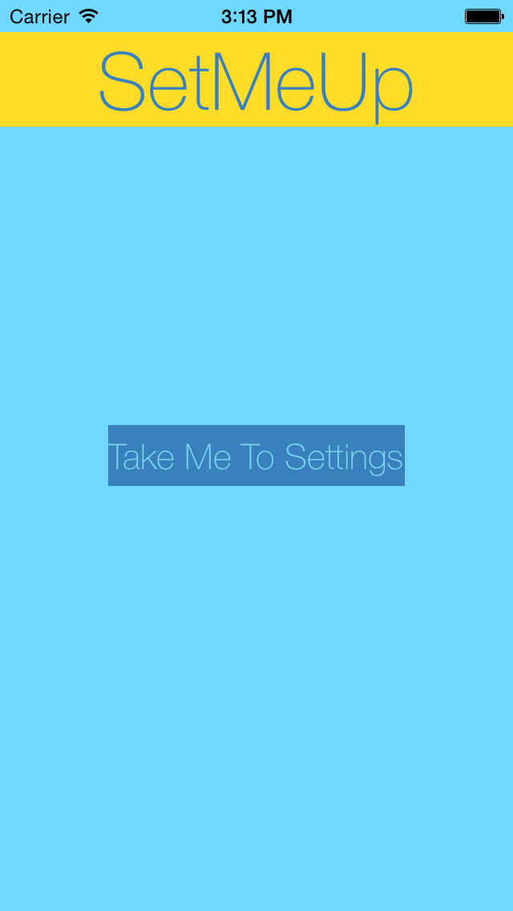
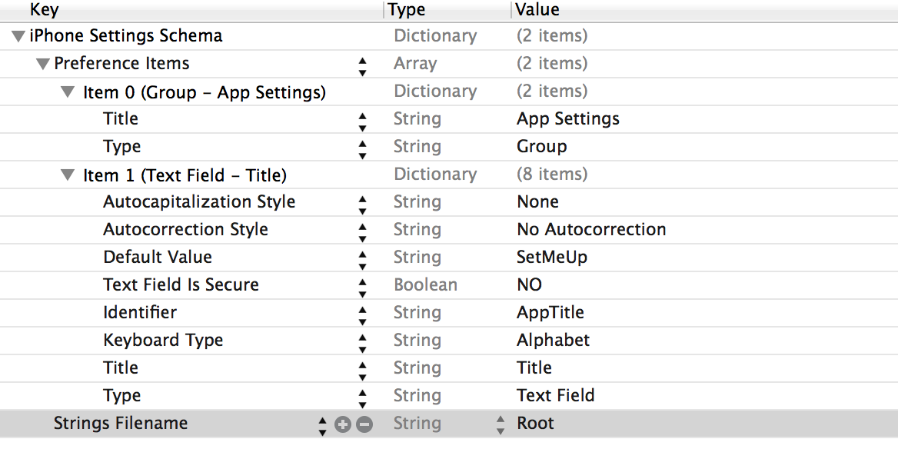

# Day 22 :: Linking to Settings App

Today's chapter is a short one, but it is definitely worth knowing. iOS provides a
really nice way to handle app settings through `NSUserDefaults`, and you've long
been able to integrate your app into the iOS settings app via a Settings bundle.
However, in order for your user to edit settings they have to make their own way
to the settings app. iOS8 introduces a way to change this.

The app which accompanies today's post is a simple one - a single page app with
a button which is linked up to the settings app. There is only one setting,
which represents the title label in the app. You can get hold of the source code
for the app on the ShinobiControls github at
[github.com/ShinobiControls/iOS8-day-by-day](https://github.com/ShinobiControls/iOS8-day-by-day).

## Linking to the Settings Page

The sample app includes a title label, whose text is defined from a setting
inside the user defaults:

    let userDefaults = NSUserDefaults.standardUserDefaults()
    titleLabel.text = userDefaults.stringForKey("AppTitle")

In order to edit this default, a settings bundle has been defined, which
includes a text field to edit this property:

New to iOS8, there's a new string constant URL which, when provided to
`openURL()` on `UIApplication` will take the user to the current app's page
within the settings app. The __Take Me To Settings__ button has the following
handler:

    @IBAction func handleTakeMeButtonPressed(sender: AnyObject) {
      let settingsUrl = NSURL.URLWithString(UIApplicationOpenSettingsURLString)
      UIApplication.sharedApplication().openURL(settingsUrl)
    }

The important new thing here is the `UIApplicationOpenSettingsURLString` string
constant. Tapping it will switch apps to the settings app, with the correct page
opened:

Since it's really easy to navigate to the settings panel, it's likely the user
will go there and then back to your app. If the app doesn't respond to the new
settings then it'll be incredibly confusing. Luckily, there is a notification to
let you know that some settings have been updated - in the form of
`NSUserDefaultsDidChangeNotification`.

You can register for this notification in the standard way:

    override func viewDidLoad() {
      super.viewDidLoad()
      // Do any additional setup after loading the view, typically from a nib.
      NSNotificationCenter.defaultCenter().addObserver(self, selector: "defaultsChanged", 
                                  name: NSUserDefaultsDidChangeNotification, object: nil)
      configureAppearance()
    }

Where the definitions of `defaultsChanged()` and `configureAppearance()` are as
follows:

    func defaultsChanged() {
      configureAppearance()
    }

    private func configureAppearance() {
      let userDefaults = NSUserDefaults.standardUserDefaults()
      titleLabel.text = userDefaults.stringForKey("AppTitle")
    }

Don't forget that with `NSNotificationCenter` you must stop observing:

    deinit {
      NSNotificationCenter.defaultCenter().removeObserver(self)
    }

This will mean that whenever the user updates any settings then the appearance
will get updated appropriately.

W> There is a bug in the iOS8 betas (last checked beta 5), which means
W> that the settings in the settings app are not persisted to NSUserDefaults.
W> Therefore this app doesn't behave as expected. This will be fixed very soon.

## Conclusion

As promised - today's post was pretty short. If you're already using a settings
bundle then this makes life super easy for your users. If you've decided to
implement your own settings UI because it's difficult to get to the settings app,
then it might be time to check out the settings bundle.

The code for today's project is available on github at
[github.com/ShinobiControls/iOS8-day-by-day](https://github.com/ShinobiControls/iOS8-day-by-day).
Take a look at it and please do say hi - I'm
[@iwantmyrealname](https://twitter.com/iwantmyrealname)
on twitter.

sam
