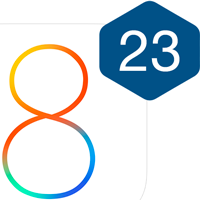
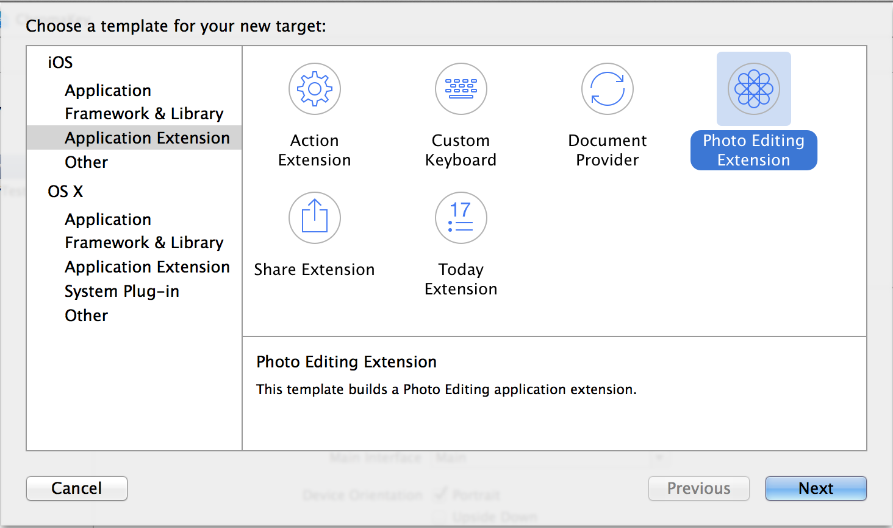
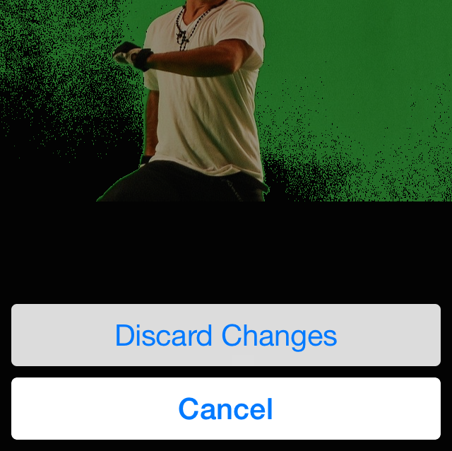

# Day 23 :: Photo Extension

{width=10%,float=left}

iOS8 Day-by-Day has looked at a couple of the new extensions in iO8 already -
the share extension and the today extension. In today's article you're going to
learn the basics behind the photo extension.

Extension points are ways that you can write your own code and functionality
which enhance the OS in more far-reaching ways than just your app. In the case
of photo extensions, you can create filters and more complex editing
functionality that will be available to the Photos app.

The sample code which accompanies today's article builds a photo extension from
the chromakey core image filter that was used in day 19. You can get the source
code from the ShinobiControls github at
[github.com/ShinobiControls/iOS8-day-by-day](https://github.com/ShinobiControls/iOS8-day-by-day).

## Creating a Photo Extension

In the same way as for the other extension types, the easiest way to create a
photos extension is to use the template provided by Xcode 6:

This create a new target, and within it a subclass of `UIViewController`, which
adopts the `PHContentEditingController` protocol. This adds some lifecycle
methods which are are specific to photo extensions.

You can probably guess from the fact that this is a view controller, that a
photo extension has UI which is provided by you. In fact, the view controller is
presented with a navigation bar containing the name of the photo extension. The
rest is up to you. Since it's just a subclass of `UIViewController` you can use
all the usual techniques, including creating the design in a storyboard.

In the ChromaKey extension which accompanies this article, a simple design
including a slider is used to display the live result from the filter, and to
configure the threshold. This layout is created in the storyboard.

The project also contains the custom `CIFilter` class from day 19 - and the 
`PhotoEditingViewController` contains a reference to one:

    class PhotoEditingViewController: UIViewController, PHContentEditingController {
      
      let filter = ChromaKeyFilter()
      ...
    }

You'll use this filter both during the interactive editing phase, and also when
rendering the final image. Note that this doesn't necessarily represent a great
use-case here: the ChromaKey filter relies on you creating an image which includes
transparency which doesn't fit with rendering as JPEG. The concepts introduced
here are all sound, and it wouldn't be too difficult to develop this extension
into something more useful.

## Starting Interactive Editing

One of the methods defined on `PHContentEditingController` signifies the
beginning of the photo editing process - 
`startContentEditingWithInput(contentEditingInput:, placeholderImage:)`. This is
called when the user selects your extension from the list in the edit menu:

At this point here it is your responsibility to grab hold of the image, provide
it to your filter and enable the interactive controls which allow the user to
edit the photo.

    func startContentEditingWithInput(contentEditingInput: PHContentEditingInput?,
                                      placeholderImage: UIImage) {
      input = contentEditingInput
      filter.inputImage = CIImage(image: input?.displaySizeImage)
      thresholdSlider.value = filter.threshold
      updateOutputImage()
    }

You are provided a `PHContentEditingInput` object, which includes info about the
media you're editing. Importantly, there are several different ways you can get
hold of an input image:

- The supplied `placeholderImage`. This is a `UIImage` of what the output of
your filter provided last time (if you're using resumable editing). Use this if
it takes a long time to set up your filter process.
- The `displaySizeImage` property on `contentEditingInput`. This is a `UIImage`
which has been appropriately scaled to the current screen size. This should be
used for interactive editing, since it will be less processor intensive than
using the full-sized image.
- The `fullSizeImageURL` property on `contentEditingInput`. This provides you
access to the full-sized image, so that you can apply the final edit to the
original image. You should only use this during the edit finalization stages.

In the __ChromaKey__ example above, a the `displaySizeImage` is pushed into
CoreImage and then provided to the filter as the input image. The slider is set
to the appropriate value and then `updateOutputImage()` is called, which invokes
the filter:

    private func updateOutputImage() {
      filter.threshold = thresholdSlider.value
      glRenderer?.renderImage(filter.outputImage)
    }

This method uses a custom `GLRenderer` class to display the image in a `GLKView`
on the screen. This ensures that the filtering and display all takes place on
the GPU, and the image isn't being passed back and forth through the CPU. The
key method of the `GLRenderer` class is `renderImage()`, which is very similar
to the code used in the CoreImage live detection code from day 13:

    func renderImage(image: CIImage) {
      glView.bindDrawable()
      if glView.context != EAGLContext.currentContext() {
        EAGLContext.setCurrentContext(glView.context)
      }
      
      // Calculate the position and size of the image within the GLView
      // This code is equivalent to UIViewContentModeScaleAspectFit
      let imageSize = image.extent().size
      var drawFrame = CGRectMake(0, 0, CGFloat(glView.drawableWidth),
                                       CGFloat(glView.drawableHeight))
      let imageAR = imageSize.width / imageSize.height
      let viewAR = drawFrame.width / drawFrame.height
      if imageAR > viewAR {
        drawFrame.origin.y += (drawFrame.height - drawFrame.width / imageAR) / 2.0
        drawFrame.size.height = drawFrame.width / imageAR
      } else {
        drawFrame.origin.x += (drawFrame.width - drawFrame.height * imageAR) / 2.0
        drawFrame.size.width = drawFrame.height * imageAR
      }
      
      // clear eagl view to black
      glClearColor(0.0, 0.0, 0.0, 1.0);
      glClear(0x00004000)
      
      // set the blend mode to "source over" so that CI will use that
      glEnable(0x0BE2);
      glBlendFunc(1, 0x0303);
      
      renderContext.drawImage(image, inRect: drawFrame, fromRect: image.extent())
      
      glView.display()
    }

In order to make the editing interactive, the threshold slider is wired up such
that as the user changes the value, the filter is updated, and the image
re-rendered:

    @IBAction func handleThresholdSliderChanged(sender: UISlider) {
      updateOutputImage()
    }

That's it for getting the photo extension up and running. Now you need to cope
with the next phases of the lifecycle - first up: when the user cancels the
edit.

## Discard Changes?

When the user sees your extension, part of the framework-provided UI is a
navigation bar including __Cancel__ and __Done__ buttons:

When the user presses the cancel button then you'll get a call to the
`cancelContentEditing()` method which will allow you to perform any tidying up
of temporary files and the suchlike before the extension disappears.

You also get a chance to tell the framework that you'd like a "are you sure?"
style dialog to be thrown up before the user dismisses your extension. This is
via the `shouldShowCancelationConfirmation` property:

    var shouldShowCancelConfirmation: Bool {
      return includesChanges
    }

In ChromaKey, there is an `includesChanges` boolean property, which defaults to
`false`, but is updated to `true` as soon as the user interacts with the slider:

    @IBAction func handleThresholdSliderChanged(sender: UISlider) {
      updateOutputImage()
      includesChanges = true
    }

This means that if the user just starts the extension and immediately cancels it
then they won't see a question dialog, but as soon as they change any values
then it'll prompt them to ask whether they'd like to discard their changes or
not:

Now you've looked at the cancel button, it's time to turn your attention to the
more important __Done__ button.

## Finalizing the Edit

Once the user has completed choosing their settings for the edit, using the
interactive editing functionality you've provided for them, they'll tap the
__Done__ button to save those changes. From your point of view, at this stage
you'll want to apply the filter the user has configured to the full size image
and then provide this back to the Photos framework for storage in the library.

`PHContentEditingController` specifies a method which will be called when the
edit is completed - `finishContentEditingWithCompletionHandler()`. At this point
you should disable any UI, and then apply the filter as it is currently
configured to the full-sized image that is provided on the `PHContentEditingInput`
object.

The following shows the implementation in __ChromaKey__:

    func finishContentEditingWithCompletionHandler(completionHandler:
                                              ((PHContentEditingOutput!) -> Void)!) {
      // Update UI to reflect that editing has finished and output is being rendered.
      thresholdSlider.enabled = false
      
      // Render and provide output on a background queue.
      dispatch_async(dispatch_get_global_queue(
                                        CLong(DISPATCH_QUEUE_PRIORITY_DEFAULT), 0)) {
        // Create editing output from the editing input.
        let output = PHContentEditingOutput(contentEditingInput: self.input)
        
        // Write the JPEG Data
        let fullSizeImage = CIImage(contentsOfURL: self.input?.fullSizeImageURL)
        UIGraphicsBeginImageContext(fullSizeImage.extent().size);
        self.filter.inputImage = fullSizeImage
        UIImage(CIImage: self.filter.outputImage.drawInRect(fullSizeImage.extent())
        let outputImage = UIGraphicsGetImageFromCurrentImageContext()
        let jpegData = UIImageJPEGRepresentation(outputImage, 1.0)
        UIGraphicsEndImageContext()
        
        jpegData.writeToURL(output.renderedContentURL, atomically: true)
        
        // Call completion handler to commit edit to Photos.
        completionHandler?(output)
      }
    }

The rendering of the larger image all takes place on a background queue,
ensuring that you aren't blocking the UI.

Within the rendering routine, the first operation is creating a 
`PHContentEditingOutput` object from the aforementioned `PHContentEditingInput`
object. This has two properties on it - one of which you'll learn about in the
_Resumable Editing_ section. The property you're interested in here is the 
`renderedContentURL`. The Photos framework expects that your editing extension
will take the image it provided at the `fullSizeImageURL` location (on the input
object), apply your editing process, and then write the result to the
`renderedContentURL`.

The next chunk of code performs just that - pulling the image from the CoreImage
context into a CoreGraphics context, so that a JPEG representation can be
created.

Once the output image has been written, then you need to tell the framework that
you're done, by calling the supplied `completionHandler()`, passing in the
output object that you created.

The Photos framework will then update both it's data store, and the underlying
asset as well. Note that, your edit will not overwrite the original asset -
instead you are providing a new version, which the user can revert at any time.
Which leads on rather nicely to the concept of resumable editing.

## Resumable Editing

As you make edits to an image, you are never replacing the original image in the
Photos library. Instead you provide an edited version of the file, and some data
which details exactly how the image was edited. This takes the form of a
`PHAdjustmentData` object, which contains three important properties:
`formatIdentifier` and `formatVersion` are strings which specify the plugin
which performed the edit, and `data` is an `NSData` blob which is used by the
editor to save the settings associated with the edit.

When a user requests editing with a specified extension, then if the image has
been previously edited, the system will call the `canHandleAdjustmentData()`
method on the `PHContentEditingController` object. At this point you can take a
look at the adjustment data object and determine whether or not your extension
understands it:

    let formatIdentifier = "com.shinobicontrols.chromakey"
    let formatVersion    = "1.0"
    func canHandleAdjustmentData(adjustmentData: PHAdjustmentData?) -> Bool {
      return adjustmentData?.formatIdentifier == formatIdentifier &&
             adjustmentData?.formatVersion == formatVersion
    }

In the ChromaKey project, the format identifier and version are specified as
variables, and the extension will only return `true` if the edit was made with
exactly the same version.

The framework then goes on to call the `startContentEditingWithInput()` method,
but the content it provides differs according to the return value of 
`canHandleAdjustmentData()`. If the extension has said that it understands the
adjustment data from the previous edit, then you'll be given the original image,
and then have to re-create the filter's settings from before. This allows the
user to update their latest edit.

However, if your extension doesn't understand the previous edit, then the
framework will provide a pre-rendered image, and your filter will be starting
from scratch - effectively layering your edit on top of the previous one.

In the `startContentEditingWithInput()` method, the following lines are added to
import the filter settings from the adjustment data:

    if let adjustmentData = contentEditingInput?.adjustmentData {
      filter.importFilterParameters(adjustmentData.data)
    }

Note that this just calls the following method on `ChromaKeyFilter` to attempt
to extract the filter settings from the provided `NSData` blob:

    func importFilterParameters(data: NSData?) {
      if let data = data {
        if let dataDict = NSKeyedUnarchiver
                            .unarchiveObjectWithData(data) as? [String : AnyObject] {
          activeColor = dataDict["color"] as? CIColor ?? activeColor
          threshold   = dataDict["threshold"] as? NSNumber ?? threshold
        }
      }
    }

The `activeColor` and `threshold` properties are preset with defaults, so that
if this fails at any point, the filter will resort to its default values:

    var activeColor = CIColor(red: 0.0, green: 1.0, blue: 0.0)
    var threshold: Float = 0.7

In order for the extension to be able to resume an existing edit, then when an
edit is completed, it needs to write this `adjustmentData` back to the Photos
framework. The `PHContentEditingOutput` object has an `adjustmentData` property
which you can populate in your implementation of the completion method,
`finishContentEditingWithCompletionHandler()`:

    let newAdjustmentData = PHAdjustmentData(formatIdentifier: self.formatIdentifier,
                                          formatVersion: self.formatVersion,
                                          data: self.filter.encodeFilterParameters())
    output.adjustmentData = newAdjustmentData

This uses another utility method on `ChromaKeyFilter`:

    func encodeFilterParameters() -> NSData {
      var dataDict = [String : AnyObject]()
      dataDict["activeColor"] = activeColor
      dataDict["threshold"]   = threshold
      return NSKeyedArchiver.archivedDataWithRootObject(dataDict)
    }

Note that `newAdjustmentData` is created using the format identifier and version
that are used as a check in `canHandleAdjustmentData()`. This is important,
since it is these that all extensions will check against to determine whether
they are going to be able to interpret a previous edit, or whether they need to
perform their filter on top of a pre-rendered image.

Now, when you run this extension, set a threshold, save the edit and then re-
edit it, you'll see that the threshold slider persists between the different
edits:

## Conclusion

Photo extensions are a quite specialized - unless your app is in the business of
providing custom image manipulation algorithms. That doesn't make them any less
cool - in fact the fact that Apple has opened up this kind of functionality is
really rather exciting for the platform.

In addition to all the easy-access retro-filters that we can all use to take
hipster photos of our food, I think it'll be really exciting to see what other
ideas people come up with. For example, you could use a photo extension to
implement a steganography algorithm right into a filter, and then use it from
the photos app. Pretty cool stuff.

The source code for today's algorithm is available, as ever, on the
ShinobiControls github at
[github.com/ShinobiControls/iOS8-day-by-day](https://github.com/ShinobiControls/iOS8-day-by-day).

