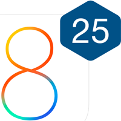
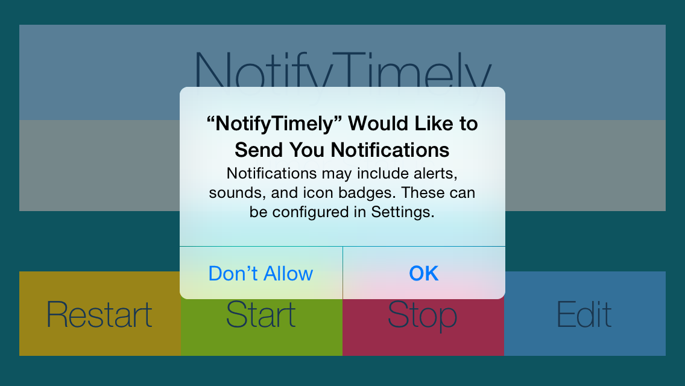
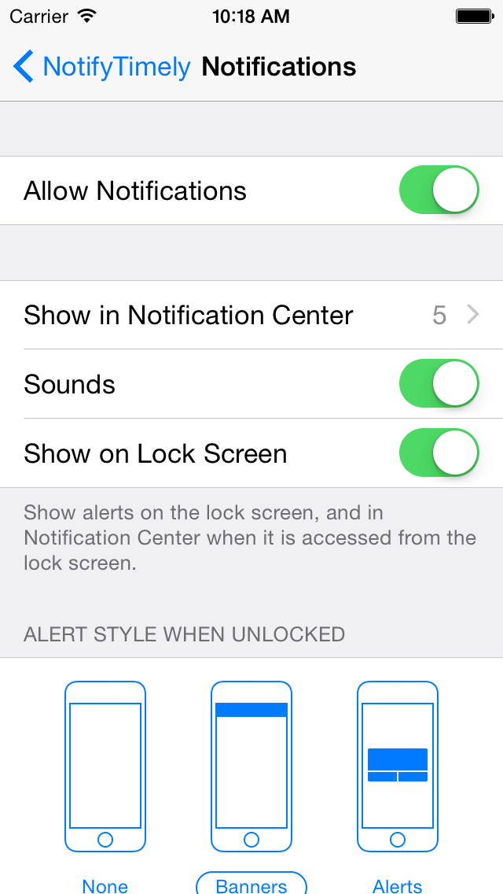
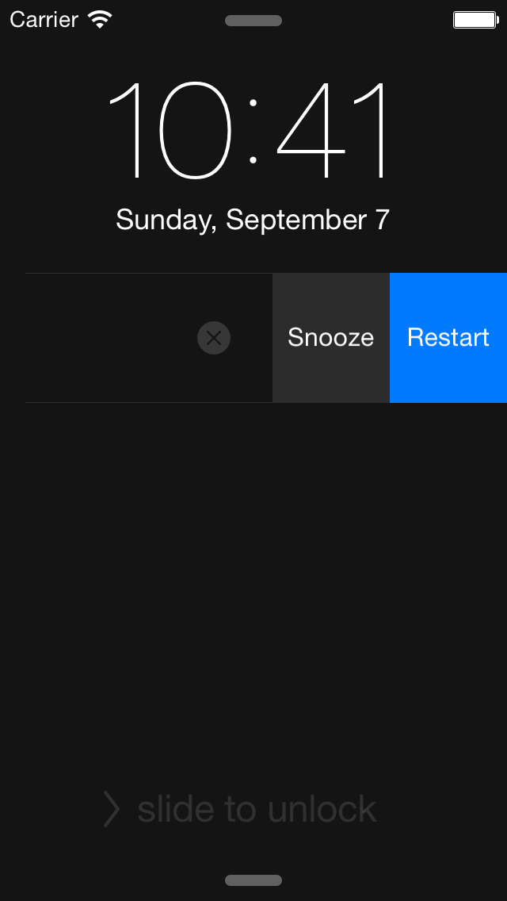
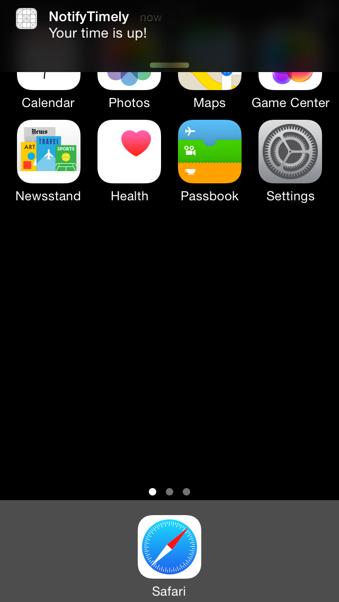
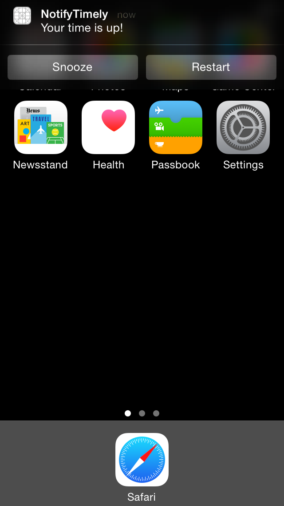
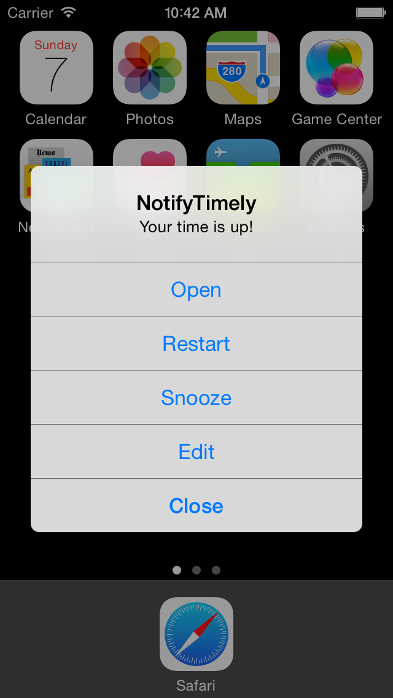
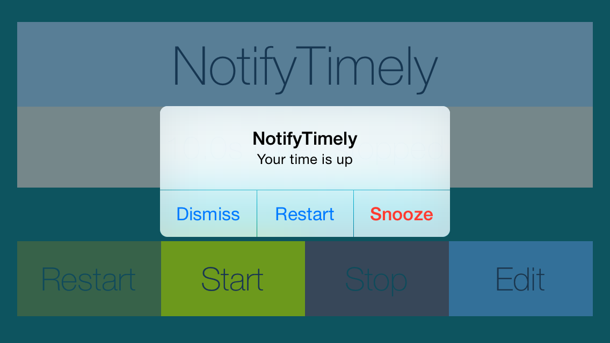

# Day 25 :: Notification Actions

{width=10%,float=left}

Local and remote notifications have been an integral part of iOS for many years
now - allowing apps to respond to events even whilst they aren't running.
Notifications are either silent or visual, with visual notifications taking the
form of alerts or banners which the user can interact with. The interaction is
very limited though - either dismissing the notification or opening the app.

iOS 8 introduces new notification actions - which allow you to hook into the
notification system and provide a set of customized actions that the user will
see and can execute alongside the notification.

This chapter digs into the new notification actions by creating a simple timer
app based on local notifications. Exactly the same principles apply for
providing custom actions for remote notifications too - just using push
notifications as a trigger. The sample application is called __NotifyTimely__
and the source code is available on github at
[github.com/ShinobiControls/iOS8-day-by-day](https://github.com/ShinobiControls/iOS8-day-by-day).

## Requesting Permission

Before getting started with the exciting new notification actions, it's worth
making note of some other changes to the UIKit notification system - in
particular the way you request permission from the user to present user
notifications.

In the past you had to request permission from the user for some aspects of
remote notifications, but not for local notifications. And the type of remote
notification (silent versus user) was mixed in with the request.

In iOS 8 these two orthogonal concepts have been split out: an app has to
register both for its interest in receiving remote notifications, and also for
the specific types of user notifications it would like to utilize (for both
remote and local use).

### Remote Notifications

Registering for remote notifications is now super-simple - there is a method on
`UIApplication` which will perform the operation for you:

    UIApplication.sharedApplication().registerForRemoteNotifications()

The user won't actually be prompted at this point - new apps will be enabled by
default, however a user can disable remote notifications through the settings
app. You can check the status using the `isRegisteredForRemoteNotifications()`
method.

You need to do this to enable remote notifications of both the silent and user
variety, and if this is enabled then silent notifications will work as expected.
However, in order for user notifications to appear, then you need to register
these as well.

### User Notifications

User notifications are alerts, icon badges and sounds which are used to gain the
user's attention. The source for these can be either remote or local
notifications and, since they can be quite disruptive, require the user's
permission.

In iOS 8, this is done using the `registerUserNotificationSettings()` method on 
`UIApplication`, providing a `UIUserNotificationSettings` object to specify what
permissions you require. In the simplest form you can use the following code to
register for sounds and alerts:

    let requestedTypes = UIUserNotificationType.Alert | .Sound
    let settingsRequest = UIUserNotificationSettings(forTypes: requestedTypes,
                                                     categories: nil)
    UIApplication.sharedApplication()
                                   .registerUserNotificationSettings(settingsRequest)

`UIUserNotificationType` can have values `.Badge`, `.Sound`, `.Alert` or `.None`,
and the `categories` parameter is related to custom actions - you'll learn about
it in the next section.

When the `registerUserNotificationSettings()` method is first run, the user will
see an alert which asks for permission to use notifications:

They won't see the alert again, but can update their choices in the app's page
in the settings app:

Once the user has responded to the user notification alert, UIKit will call the 
`application(_, didRegisterUserNotificationSettings:)` on the app delegate, with
the results of the request. Alternatively, the `currentUserNotificationSettings()`
method on `UIApplication` will provide you with the most up-to-date settings.
You can use this to alter your app's behavior appropriately - preventing the
creation of notifications which will never appear.

That completes this aside about notification permissions - now on to the more
interesting topic of notification actions.

## Registering Actions

On first glance, the workflow for providing custom actions for notifications
might seem a little complicated, but it really isn't. Since user notifications
could be fired both by remote and local notifications, it's not possible to
completely define a notification and its actions within the notification itself -
remote notifications need to be as small as possible.

Therefore the different notifications are pre-defined. Well, the _category_ of
notification is pre-defined - obviously the content is dependent on the
notification itself.

A `UIUserNotificationCategory` defines a set of actions which will accompany a
notification of that type. For example a "new email" notification would want
actions such as reply and delete, whereas a "timer fired" notification would
need restart and edit.

The actions themselves are formed from `UIUserNotificationAction` objects, more
often created using the `UIMutableUserNotificationAction` counterpart. For
example, the action associated with restarting the timer:

    let restartAction = UIMutableUserNotificationAction()
    restartAction.identifier = restartTimerActionString
    restartAction.destructive = false
    restartAction.title = "Restart"
    restartAction.activationMode = .Background
    restartAction.authenticationRequired = false

The properties:
- `identifier` is a string which you'll use to determine which button the user
pressed when handling the notification action.
- `destructive` if true will present the button in a red "danger" color
- `title` the text that appears on the button
- `activationMode` determines whether or not the app needs to be launched in the
background or the foreground. If you need further UI to complete the action then
the app must be launched in the foreground, but if you just need a few seconds
of CPU time to complete processing the action, then this can be performed in the
background.
- `authenticationRequired` if the user needs to enter their PIN or TouchID in
order to carry out the action. Note that if you have a background action which
does not require authentication then the device will remain locked. Therefore,
you need to prepare for the level of access to the keychain and filesystem that
you'll be provided.

Once you've created the actions that you want to use, you have to collect them
together in a `UIUserNotificationCategory`, via its mutable sister:

    let category = UIMutableUserNotificationCategory()
    category.identifier = timerFiredCategoryString
    category.setActions([restartAction, snoozeAction], forContext: .Minimal)
    category.setActions([restartAction, snoozeAction, editAction],
                        forContext: .Default)

The `identifier` is again a string, and is this time used to specify which set
of actions the system should present to a user when a notification fires. You'll
see how to use this in local notifications in the next section, but for remote
notifications, a new `category` key has been added to the JSON spec for push
messages, and the value should be one of the notification categories you've
registered for your app.

Call `setActions(_, forContext:)` to add the actions to the
`UIMutableUserNotificationCategory`. The first parameter is just an array of the
actions you wish to add, and the second parameter is of type `UIUserNotificationActionContext`,
which can be either `.Minimal` or `.Default`. This context parameter is used
which actions to show in different scenarios:

- `.Minimal` - when a notification appears on the lock screen or notification
center and the user drags to the left, or when the notification is a banner and
the user drags down. These all have a maximum of two actions due to limited
space.

- `.Default` - when a notification appears as an alert and the user selects the
__Options__ button. The alert view will expand to a sheet, where a maximum of
four actions can be provided to supplement the system __Open__ and __Close__
actions.

Once you've created all the user alert categories your app will need, you must
ensure that you register them with the system, by updating your registration
code as follows:

    let requestedTypes = UIUserNotificationType.Alert | .Sound
    let categories = Set(arrayLiteral: timerFiredNotificationCategory())
    let settingsRequest = UIUserNotificationSettings(forTypes: requestedTypes,
                                                     categories: categories)
    UIApplication.sharedApplication()
                                   .registerUserNotificationSettings(settingsRequest)

This uses the `categories` argument of `UIUserNoficationSettings()`, but
providing a `Set` of the different categories your app will require.

Now you've done that, your app is ready to display these notifications with
custom actions, so let's see how to do that with local notifications.

## Firing Actions

To support these new user notification categories, `UILocalNotification` has a
new `category` property in iOS 8. This is a string, and its value should either
be `nil`, or match the `identifier` of one of the categories registered with the
app.

In the timer app, a new local notification is created with a specific offset
time, using the following utility method:

    private func createTimer(fireOffset: Float) -> UILocalNotification {
      let notification = UILocalNotification()
      notification.category = timerFiredCategoryString
      notification.fireDate = NSDate(timeIntervalSinceNow:
                                                          NSTimeInterval(fireOffset))
      notification.alertBody = "Your time is up!"
      return notification
    }

Note that here the `timerFiredCategoryString` is part of a set of global
constant strings created:

    let restartTimerActionString = "RestartTimer"
    let editTimerActionString = "EditTimer"
    let snoozeTimerActionString = "SnoozeTimer"
    let timerFiredCategoryString = "TimerFiredCategory"

This notification is then scheduled in the standard way:

    let timer = createTimer(fireOffset)
    UIApplication.sharedApplication().scheduleLocalNotification(timer)

Now, provided the app isn't in the foreground, when the notification fires, the
system will present context dependent UI to the user, as shown in the
screenshots in the previous section.

This is great, but tapping on the buttons doesn't actually do anything, yet.

## Handling Actions

All the previous application delegate call-backs associated with notifications
still exist and work, but two new ones have been added:

- `application(_, handleActionWithIdentifier:, forRemoteNotification:, completionHandler:)`
- `application(_, handleActionWithIdentifier:, forLocalNotification:, completionHandler:)`

Clearly the only difference between these two methods is the original source of
the notification - all of the other parameters are the same.

The action identifier argument is a string, that corresponds to the `identifer`
property on the previously-created `UIUserNotificationAction` . This is used to
determine which button the user actually pressed.

The `completionHandler` argument is a closure which you need to call once you've
finished processing the action. It's great that you're provided this - it means
that you can perform asynchronous operations without the system killing your
process when you're in the background.

The following is the implementation of the handler for local notification in the
accompanying timer app:

    func application(application: UIApplication,
                     handleActionWithIdentifier identifier: String?,
                    forLocalNotification notification: UILocalNotification,
                    completionHandler: () -> Void) {
      // Pass the action name onto the manager
      timerNotificationManager.handleActionWithIdentifier(identifier)
      completionHandler()
    }

In this instance, the action is handled by the timer manager in the following
method:

    func handleActionWithIdentifier(identifier: String?) {
      timerRunning = false
      if let identifier = identifier {
        switch identifier {
        case restartTimerActionString:
          restartTimer()
        case snoozeTimerActionString:
          scheduleTimerWithOffset(snoozeDuration)
        case editTimerActionString:
          delegate?.presentEditOptions()
        default:
          println("Unrecognised Identifier")
        }
      }
    }

Note that if your action was specified to be `.Foreground`, then the handle
action method will be called after the app has relaunched into the foreground.
This means in the case of the timer app, that the `delegate` property on the
timer manager will have been set, and therefore the following code will run:

    func presentEditOptions() {
      performSegueWithIdentifier("configureTimer", sender: self)
    }

Resulting in the edit UI being presented - right from tapping a button in a
notification:

If the actions are specified to be `.Background`, then the UI will obviously not
be loaded, and you'll get a few seconds to complete whatever tasks you need.

## Foreground Notifications

As before, UIKit will only present the notification UI if the app is not
currently active (i.e. in the foreground). Although this hasn't changed, it's
still worth remembering how to create your own alert which appears when the
foreground app receives a notification:

    func application(application: UIApplication,
      didReceiveLocalNotification notification: UILocalNotification) {
      // Pass the "firing" event onto the notification manager
      timerNotificationManager.timerFired()
      if application.applicationState == .Active {
        let alert = UIAlertController(title: "NotifyTimely",
                                      message: "Your time is up",
                                      preferredStyle: .Alert)
        // Handler for each of the actions
        let actionAndDismiss = {
          (action: String?) -> ((UIAlertAction!) -> ()) in
          return {
            _ in
            self.timerNotificationManager.handleActionWithIdentifier(action)
            self.window?.rootViewController?
                                .dismissViewControllerAnimated(true, completion: nil)
          }
        }
        
        alert.addAction(UIAlertAction(title: "Dismiss", style: .Cancel,
                                handler: actionAndDismiss(nil)))
        alert.addAction(UIAlertAction(title: "Restart", style: .Default,
                                handler: actionAndDismiss(restartTimerActionString)))
        alert.addAction(UIAlertAction(title: "Snooze", style: .Destructive,
                                handler: actionAndDismiss(snoozeTimerActionString)))
        window?.rootViewController?.presentViewController(alert,
                                                    animated: true, completion: nil)
      }
    }

This method checks to see that the app state is `.Active`, before creating a new
`UIAlertController` to present to the user. The actions associated with the
alert actually just trigger exactly the same handler methods as the notification
alert handler does, so actually the amount of duplicated code is kept to a
minimum.

This produces an alert like this:

## Conclusion

The most important part of today's post is that you absolutely __must__ update
your existing apps. Otherwise, come iOS 8, users will no longer see the
notifications you'd expect them to. The API for registering for notifications is
pretty simple, and separating out the arrival vector from the user notification
permissions makes it easier for both developers and users to understand.

That's not the most fun part though. Being able to specify custom actions for
notifications could be really quite powerful. In some cases you'll be able to
have entire apps which provide incredibly powerful functionality whilst never
actually being launched into the foreground. Even though you only get two or
four 'slots' in which to put your custom actions, there is a lot you can do with
that, and I'm quite excited to see what the apps whose notifications I read
every day decide to do with them.

As ever, all the code for today's sample project __NotifyTimely__ is available
on the ShinobiControls github page at
[github.com/ShinobiControls/iOS8-day-by-day](https://github.com/ShinobiControls/iOS8-day-by-day).

