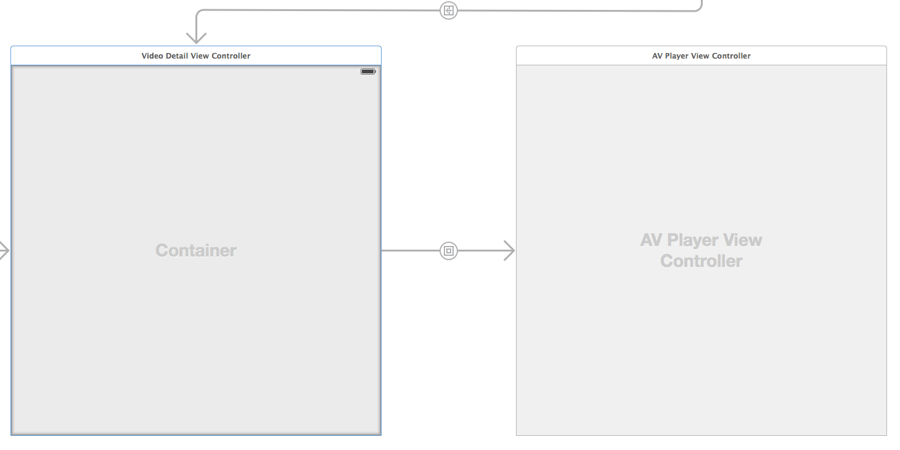
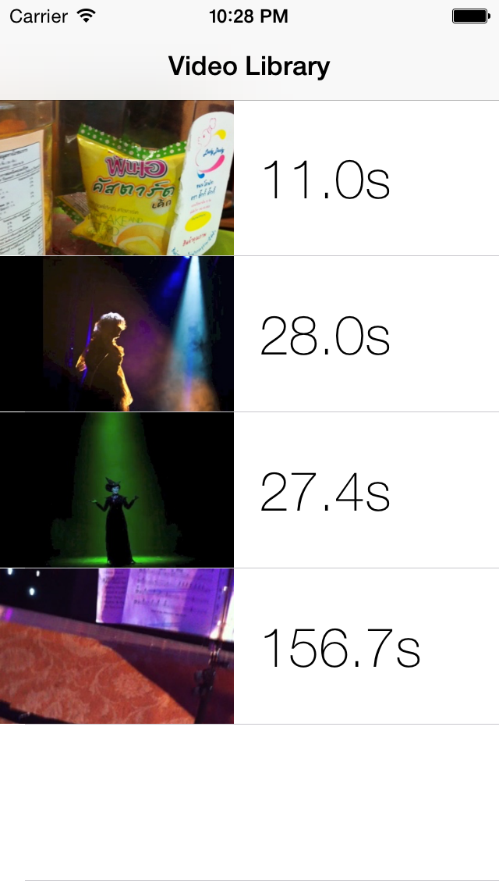

# Day 26 :: AVKit

{float=left}

If you want to play a video in iOS then you've traditionally been presented with
two choices. If you want simple playback with framework provided UI then you
could use `MPMoviePlayerViewController`, or if you require fine-grain control of
the underlying `AVFoundation` pipeline then you could use an `AVPlayer`,
rendered through an `AVPlayerLayer`. The problem with these approaches is that
the former doesn't give you much control over the playback process, whereas the
latter requires that you create your own UI.

AVKit is new to iOS8 and pulls both scenarios into a common pipeline.
`AVPlayerViewController` effectively deprecates `MPMovePlayerViewController`,
and sits on top of AVFoundation. It provides contextual video playback UI that
matches that of the OS, and plays any `AVPlayer` object from AVFoundation.

In today's chapter you'll discover how easy it is to integrate AVKit into your app,
and see some of the cool new things you can do. The app which accompanies the
article is a simple video player, which uses the Photos framework to find videos
in the user's library, and then plays them using AVKit. You can download the
source code from the ShinobiControls github at
[github.com/ShinobiControls/iOS8-day-by-day](https://github.com/ShinobiControls/iOS8-day-by-day).
If you're using the simulator then you can add some videos to the library by
dragging them in from the finder, and then selecting "save" from the sharing
menu.

## Using AVKit to play a video

AVKit is an incredibly simple framework - consisting of just one class on iOS - 
`AVPlayerViewController`. This is a subclass of `UIViewController` with a few
additional properties associated with video playback. The most important of
these is the `player` property, which is of type `AVPlayer`. This is a class
from AVFoundation and represents the control of playback. In the past if you
wanted to use `AVPlayer`, you'd use the `AVPlayerLayer` subclass of `CALayer` to
visualize the video stream, and create your own UI for video controls.
`AVPlayerViewController` handles both of these things for you, simply by setting
the `player` property to an `AVPlayer` object.

`AVPlayerViewController` is fully integrated into Interface Builder - so you can
just drag one onto the storyboard from the object library:

In this example, the player is a contained by the `VideoDetailViewController`,
which sets up the `player` property appropriately.

W> __Note:__ If you do reference AVKit within the storyboard, then you may well
W> have to manually link against the library yourself - like off've the olden days.
W> You can do this from the project settings page, in the _Linked Frameworks and
W> Libraries_ panel.

There are two ways you can create an `AVPlayer` - either with a URL or a
`PlayerItem`. The URL approach matches the `MPMoviePlayerViewController` use
case - where the location of a video file, either local or remote, is provided.
AVFoundation then takes care of grabbing the content, buffering it and then
playing it back.

      if let avpVC = self.childViewControllers.first as? AVPlayerViewController {
        dispatch_async(dispatch_get_main_queue()) {
          let url = NSURL(string: "/path/to/my/video")
          avpVC.player = AVPlayer(URL: url)
        }
      }

The player-item approach is a link into the AVFoundation pipeline, and allows
you to specify assets and create AVFoundation compositions for playback.

Setting the `player` property is all that you you need to do to get video
playback with fully adaptive and context aware playback controls:

## Integration with Photos Framework

Back in chapter 20
we had a quick run-down of the new Photos framework, and how it can make access
to the photo library super-easy on iOS8. Well, despite its name, the Photos
framework also includes access to all of the videos in the user's library, and
with that comes the ability to use AVKit for easy playback.

If you take a look at the accompanying __VCR__ app, you'll see it is a master-
detail app, which shows a list of all videos, with thumbnails in the master, and
then plays the video back when the user taps on a specific cell.

Grabbing all the videos from the library using the Photos framework is simple:

    videos = PHAsset.fetchAssetsWithMediaType(.Video, options: nil)

And getting thumbnails for the table cells is similarly easy:

      self.imageManager?.requestImageForAsset(videoAsset,
                                        targetSize: CGSize(width: 150, height: 150),
                                        contentMode: .AspectFill, options: nil) {
        image, info in
        self.thumbnailImageView.image = image
      }

The `PHImageManager` class has several methods for requesting video content -
one of which will return a `AVPlayerItem` - exactly what's needed to create the
`AVPlayer` needed by AVKit. It's an asynchronous API, since the `PHAsset` you're
requesting the `AVPlayerItem` for might well be remote. Here, the `videoAsset`
is a property of type `PHAsset`, provided by the master view controller during
the segue to the detail:

      imageManager?.requestPlayerItemForVideo(videoAsset, options: nil,
        resultHandler: {
        playerItem, info in
        self.player = AVPlayer(playerItem: playerItem)
      })

The `player` property has a `didSet` closure, which will provide the new 
`AVPlayer` to the appropriate child view controller:

    var player: AVPlayer? {
      didSet {
        if let avpVC = self.childViewControllers.first as? AVPlayerViewController {
          dispatch_async(dispatch_get_main_queue()) {
            avpVC.player = self.player
          }
        }
      }
    }

Note that since setting the `player` property on the `AVPlayerViewController` is
going to be performing lots of UI operations, it's imperative that it is called
on the main queue - hence the `dispatch_async()` call.

You can see this in action in the __VCR__ app which accompanies the project. It
has a relatively small amount of code to create a simple video browser and
playback tool.

## AVFoundation Pipeline

As mentioned at the top of this article, on of the great features of the new
`AVPlayerViewController` is that it sits on top of, and allows access to, the
underlying AVFoundation pipeline. This means that you can easily visualize the
output of the complex compositing and audio-mixing effects that you apply to
your input videos.

As a simple demonstration of this, the __VCR__ app uses `AVQueuePlayer` to
preface the playback of every video in the library with a surprisingly
irritating countdown timer.

    func configureView() {
      if let videoAsset = videoAsset {
        imageManager?.requestPlayerItemForVideo(videoAsset, options: nil,
          resultHandler: {
          playerItem, info in
          self.player = self.createPlayerByPrefixingItem(playerItem)
        })
      }
    } 

Here, the `createPlayerByPrefixingItem()` method is used to create an `AVPlayer`
which includes the requested item, and also the `countdown_new.mov` file, located
within the app's bundle:

    private func createPlayerByPrefixingItem(playerItem: AVPlayerItem) -> AVPlayer {
      let countdown = AVPlayerItem(URL: NSBundle.mainBundle().URLForResource("countdown_new", withExtension: "mov"))
      return AVQueuePlayer(items: [countdown, playerItem])
    }

This means that when the user selects a video for playback, they'll first have
to sit through this delight:

Obviously this is somewhat of a stupid example, but it shows that you have
access to the complete AVFoundation pipeline, as well as the convenience of
system-provided playback UI.

## Conclusion

If you're using `MPMoviePlayerViewController` then you don't need to worry about
it being deprecated - it's still around. However, more than likely, it'll be a
really easy operation to switch to the new `AVPlayerViewController` - much of
the API is replicated (well, from `MPMoviePlayerController`). 

If you've had to implement your own UI on top of an `AVPlayerLayer` then
transitioning to `AVPlayerViewController` is likely to be a little more
difficult. However, it does reduce the area of code that you're responsible for
as iOS upgrades in future. It also ensures that a common appearance for playing
videos is used across both the system apps and yours.

Combined with the ease of plugging the new Photos framework into AVKit, it's
certainly worth taking a look at. If you're implementing new video playback
functionality in an app then AVKit is definitely the place to start - and will
serve you well 90% of the time.

As mentioned in the introduction, the accompanying app demos building a simple
video browser and player for all the videos in the user's library. The source
code is available on github at
[github.com/ShinobiControls/iOS8-day-by-day](https://github.com/ShinobiControls/iOS8-day-by-day).
