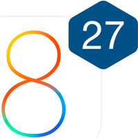
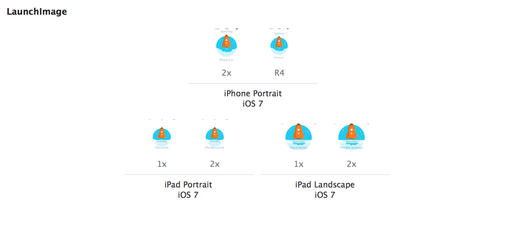
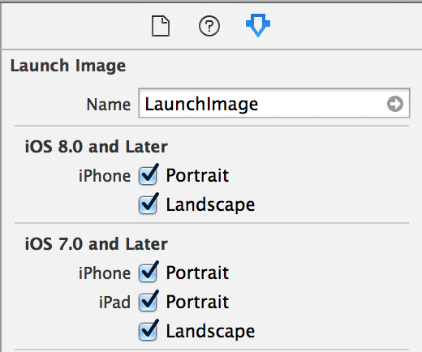
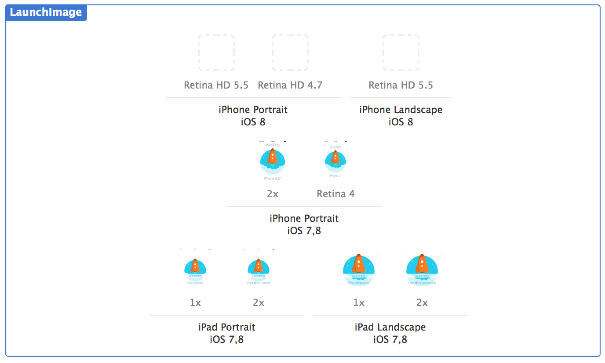

# Day 27 :: Launch Images

{width=10%,float=left}

One of the new features in iOS 8 and Xcode 6 that has maybe slipped under the
radar a little is an update in the ways you can specify launch screens.
Traditionally, these have been images which are display immediately on app
launch, before the live app UI is ready to go. With the introduction of the new
screen sizes of the iPhone 6 and iPhone 6 Plus, the lack of scalability of the
image-based approach is starting to show. Luckily, you can now provide a
storyboard or XIB file which will be used as the launch screen, across all
flavors of device.

Today's article will take a look at how (and why) to upgrade an app which was
built using Xcode 5 to use the new XIB-based approach. As such there is an
accompanying app that demonstrates the usage - available on the ShinobiControls
github at
[github.com/ShinobiControls/iOS8-day-by-day](https://github.com/ShinobiControls/iOS8-day-by-day).

## Scaling the existing approach

Launch screens are meant to be subtle - their sole purpose being to give the
impression that the app is loading super-fast. Therefore, in Apple's Human
Interface Guidelines, it suggests that launch screens should actually be
identical to the first screen of the app, minus any dynamic content such as
text.

In iOS 7 you would provide the content for the launch screen as images in an
asset library - requiring one image per device that it would run on. Taking in
to account the fact that iPads can launch apps in both portrait and landscape
orientations, and the existence of both retina and non-retina screens, this
means that you need to create a total of 6 different launch images:

The addition of iPhone 6 and iPhone 6 Plus actually means that you have to
produce three more launch images - since the iPhone 6 Plus can actually launch
apps in landscape.

If you open an iOS 7 app in Xcode 6 and head on over to the __LaunchImage__ asset
in the asset catalog, then you might expect that there would be some new empty
spaces to fill, but this isn't the case. You first need to enable the new iOS8-
only types, which can be done using the attributes inspector:

Having checked the two boxes associated with iOS 8 iPhone orientations, the asset
will be updated:

T> __Top Tip:__ Until you either populate these new image cells, _or_ provide a
T> XIB/Storyboard launch screen, then your app will run in scaled mode on iPhone 6
T> and 6 Plus. It's therefore _really_ important to add this when upgrading your
T> old apps if you want to properly support the new devices.

Although this approach is perfectly viable, there are a couple of issues:

- It's a pain having to generate 9 different launch images for your app
- The images are obviously part of your app bundle, and therefore get
distributed with you app. That's _all_ of the images. One device will need at
most two of the images, which means that your app includes at least seven images
that it will _never use_.

Surely there's a better way?

## Creating a launch screen XIB

As Apple's Human Interface Guide suggests that your launch screen should
probably look like the first screen that a user sees, then wouldn't it be great
if you could create the launch screen in the same way as you create your UI?
Well, with iOS 8 you can - by providing a launch screen as a XIB.

When you create a new iOS project in Xcode 6 then it'll automatically create a
XIB launch screen file and set up the project correctly to use it, but upgrading
an existing app is pretty easy as well.

There's a new template for a launch screen file, which you can use by creating a
new file in your project:

This will create a default screen containing the name of your project, and some
copyright information:

If you run the app up now, then you'll see that your app is still using the old
files - you need to tell the project what to use as a launch screen. You can do
this in the __App Icons and Launch Images__ panel of your app's settings.

You need to select the XIB you created from the __Launch Screen File__ drop down
menu, and update the __Launch Images Source__ to __Don't Use Asset Catalogs__:

Once you've done this you can build and run your app and notice that the new
launch screen is being used in place of the old images, which you can delete.

W> __Note:__ It seems that the new launch images don't always work on simulators,
W> so be sure to check them out on a device.

## Restrictions on Launch Screen XIBs

The launch screen XIBs don't support all the features you're used to from IB, so
don't get too carried away. The XIB is meant to be very quick to render, and the
(presumably) cached on the device - therefore there are some restrictions on
what UI elements you can use.

You should construct the UI from __UIImageView__ and __UILabel__ objects -
definitely not __UIWebView__. There can be no custom code associated with a
launch XIB, so outlets and custom classes won't work.

You can (and absolutely should) use Auto Layout to layout your UI. Your XIB is
also fully size-class compliant, which is how you should be adapting the launch
screen to the different devices it will run on.

For more information about adopting adaptive layout in iOS 8 you should check 
out day 7 of iOS 8 Day-by-Day.

## Conclusion

This is a welcome improvement to iOS and Xcode, making the development and
release process that little bit easier, and also delivering app bundle size
improvements.

However, the biggest takeaway from today's article should be that you need to
either provide new launch images or make the change to XIB launch screens if you
properly want to support the new iPhone 6 and 6 Plus. This isn't particularly
obvious - since your app will run on the new devices, but it runs in scaled
mode.

Today's app is a little bit different because it was actually created with Xcode
5 and then upgraded to include the new launch XIBs in Xcode 6. As such, the git
history might be of some use in looking how this was achieved. It's available in
the iOS 8 Day-by-Day git repo on github at
[github.com/ShinobiControls/iOS8-day-by-day](https://github.com/ShinobiControls/iOS8-day-by-day).
