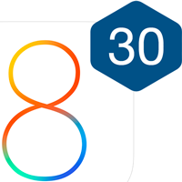
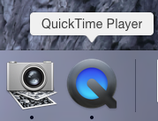
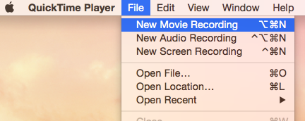
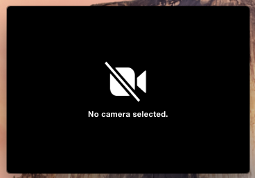
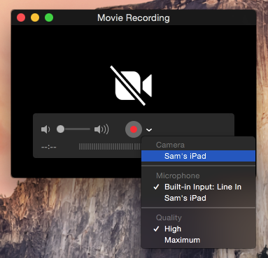
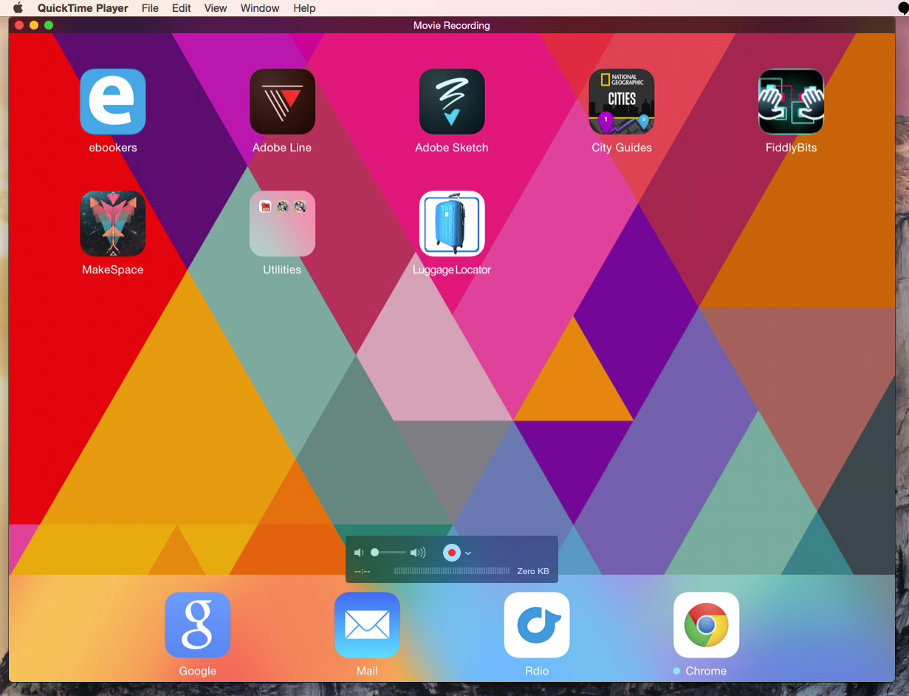

# Day 30 :: App Previews

{width=10%,float=left}

The screenshots that adorn your app's page in the App Store have always been
incredibly important in advertising your app - giving a flavor of what a user
can expect and attempting to get them to push the all-important __Buy__ button.
Back when iOS7 was first announced I wrote a blog post about how given the new,
flatter UI design, screenshots just weren't going to cut it any more 
([iOS7: What does it mean for developers?](http://www.shinobicontrols.com/blog/posts/2013/07/01/ios7-what-does-it-mean-for-developers)),
and it seems that Apple agree. Starting with iOS8, you can now upload a short
video to demo your app, to be displayed alongside the screenshots in the App
Store.

In today's article you'll learn how to create these videos, and take a look at
some of the recommendations from Apple regarding their content. Since it's still
early days in the video approval process, there is little empirical evidence
as to how strictly the rules are applied - with time the community will learn
both what what works, and what Apple is happy to approve.

In a change to the standard format, today's post doesn't have a sample project.
It does describe how to get started with recording video from your device - with
a sample demoing the __MarqueeMaker__ action extension from day 29.

## Recording a Video

In the past, when wanting to record video from a device you'd have to resort to
using AirPlay and a 3rd-party app on OSX. AirPlay has low resolution, and a high
compression ratio - allowing it to work over wireless networks. This means that
a recording from a device looks shabby at best.

New to iOS8 and OSX Yosemite, it's now possible to record directly from the
device onto your computer. In fact, when you plug in an iOS8 device (via a
lightning cable) it appears as a new camera.

To record a video, you need to start out by opening QuickTime. Note, that by
default, QuickTime doesn't open a window when you start it - but you can see
that it has started in the dock:

You start a new recording via the __File__ menu:

This will open a new window and tell you that you need to select a camera:

If your iOS8 device is connected via a lightning cable then you'll be able to
select it as a camera from the source menu:

QuickTime will then resize to mirror your device's current screen, at which
point you can start recording. Notice also that the status bar has changed from
the regular one to the standard one - displaying the "Apple Time" of 09:41,
removing your service provider and filling your battery:

This will allow you to create a simple video, that at the very least will allow
you to record the source material to cut together to build your complete demo
video.

## Video Considerations

Although this sorts the technicalities of actually getting video from a device
into a recording, it's only the tip of the iceberg that is creating a great
video.

Apple has created a page full of info about how to create [App Previews](https://developer.apple.com/app-store/app-previews/),
which goes some way to helping work out what to do. Some of the most important
points are summarized below:

- __Videos should be 15 to 30 seconds in length__
- __The video will appear before the screenshots__
- __iTunes Connect allows you to choose a poster image__. This is the image that
is displayed before the video starts playing. Note that you can't change this
without uploading a new binary to iTunes Connect, so choose wisely. Remember
that this poster frame is taking the place of the first screenshot - so make
sure it is as powerful as the screenshot it is replacing.
- __You can submit device-specific videos__. This means iPad, 4-inch iPhone, 4.7-
inch iPhone and 5.5-inch iPhone can all have their own videos.
- __Apple is keen on well-produced videos__. this involves careful planning,
storyboarding to create a well-formed story. It should demo the top 5 features
of your app.
- __Prepare appropriate demo data__.
- __Previews (like screenshots) are for all audiences__. This means the content
needs to be suitable for the 4+ age-group.
- __Videos are not localized__. This is good in one respect - you don't need to
create hundreds of versions of the same video. However, if you're marketing in
multiple markets, you need to ensure that your video is understandable
irrespective of the user's native language. You also can't include any pricing
details, since these will vary by territory.
- __Soundtracks are encouraged__. Make sure you have the rights for everything
you want to use in your video.
- __In-app purchases must be disclosed__. If your demo shows features only
available via in-app purchase, you have to notify users of this. In a language-
agnostic manner. Good luck with that.
- __Videos should only feature on-device footage__. You should not have video of
somebody using the app, or anything similar. In this respect it should be very
much like the screenshots you're used to producing.

Apple has helpfully produced a PDF guide of how to create app previews using
[Final Cut Pro](https://developer.apple.com/app-store/app-previews/final-cut-pro/Creating-App-Previews-with-Final-Cut-Pro-X.pdf),
which gives you some indication of the level of quality that Apple is expecting.

## Conclusion

There are a couple of different things in today's article - the ability to record
video from a device, and app previews. I think that the ability to record video
is super-useful - and is something that was never really very easy to achieve in
the past.

From a user's perspective, app previews are a definite win - for exactly the
reasons I outlined in the aforementioned article last year. Getting a 'feel' for
an app via static screenshots has become increasingly difficult, so app preview
videos will make life easier.

However, for developers, app previews represent yet another thing that needs to
be done as part of the release process. Due to their nature, they are likely to
benefit large shops - who have the skills to create this kind of creative. I
think that small developer-only teams will find creating compelling videos quite
hard work. Remember, huge amounts of money are spent on creating TV advertising,
which are also 30s videos. Some of the restrictions that Apple have laid out
will help level the playing field between those who have money to burn and those
who don't.
