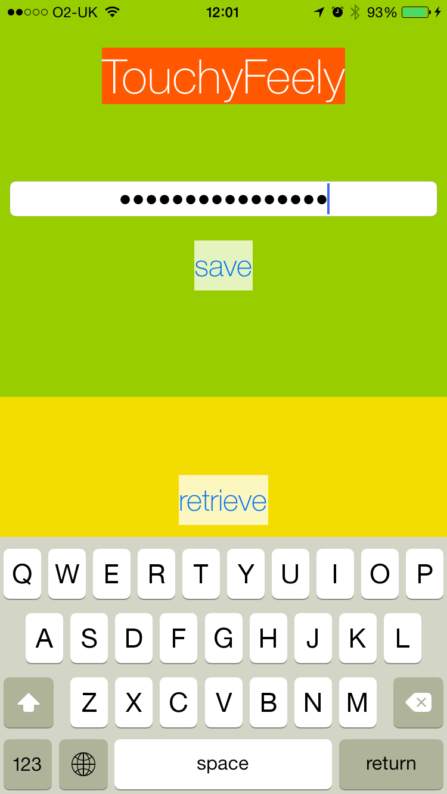

# Day 31 :: Using Touch ID to Secure the Keychain

{width=10%,float=left}

The iPhone 5s introduced the world to Touch ID - the ability to authenticate
with your device using just a finger print. In iOS 7 use of this was limited to
unlocking the device, and purchases against your Apple ID. Developers were
desperate to get hold of an API to allow them to use this secure and convenient
method of authentication in their own apps. In iOS 8 this is now possible.

There are two classes of problem that you can solve using Touch ID in iOS 8 -
authentication to access content of the Keychain, and confirming user presence
for your own app's usage. Today's article takes a look at how to use Touch ID in
tandem with the Keychain. If you want to know more about using Touch ID to
perform user authentication then take a look at LocalAuthentication in the
documentation.

The sample app which accompanies today's post is a very simple app which uses
the Keychain to save a secret and requires Touch ID authentication in order to
retrieve it. The code is available on the ShinobiControls github at
[github.com/ShinobiControls/iOS8-day-by-day](https://github.com/ShinobiControls/iOS8-day-by-day).

## Secure Enclave

Before getting coding, it's worth understanding a little background regarding
the way the Keychain works on iOS devices. Devices with Touch ID have a hardware
'device' called a secure enclave. This is responsible for the cryptographic
operations on the device including encryption of the Keychain, and managing the
Touch ID fingerprints. This means that the OS never has access to the
fingerprints themselves - but instead defers authentication to the secure
enclave.

When you store something in the Keychain, it gets encrypted. When you request it
back from the Keychain, then the encrypted data gets passed to the secure
enclave which performs the decryption. Since the secure enclave is also
responsible for authenticating Touch ID, if the Keychain item requires Touch ID
authentication then it will only decrypt the token if the Touch ID is
successful.

Although it's not entirely necessary to know this, it's important to realize
that the APIs made available to developers allowing them to leverage Touch ID
don't provide access to the finger prints, or indeed the UI which accompanies
the request for authentication. In fact, in the case of securing the Keychain,
if you already have experience of using the Keychain on iOS, then there is very
little to learn.

## Access Control Lists

When you create items on the Keychain you set various attributes, which specify
both what the item represents, and the access level that it should have. For
example, the following specifies that you are creating a password entry, for the
given service and user name:

    private func save(token: String) {
      if let data = token.dataUsingEncoding(NSUTF8StringEncoding,
                                            allowLossyConversion: false) {
        
        // Rather than update, just delete and continue
        delete()
                
        let keyChainQuery = [
          kSecClass as! String       : kSecClassGenericPassword,
          kSecAttrService as! String : serviceIdentifier,
          kSecAttrAccount as! String : accountName,
          kSecValueData as! String   : data
        ]
        
        SecItemAdd(keyChainQuery, nil)
      }
    }

This actually works out quite nicely in Swift - the dictionary is bridged to its
CoreFoundation counterpart, as are the strings and NSData object.

iOS 8 adds the concept of Access Control Lists (ACL) to the Keychain. These are
used to specify the _accessibility_ and _authentication_ associated with the
keychain item to which they are applied:

- __Accessibility__ represents when a particular item should be readable - for
example when the device is unlocked, or limiting it to this device only (i.e.
not shared via iCloud Keychain). This behaves in exactly the same way that the
`kSecAttrAccessible` attribute does.
- __Authentication__ is a new concept, and is represented by a policy. The
policy specifies what authentication requirements have to be satisfied before
the system will decrypt the Keychain item.

Currently, the only authentication policy is "user presence" - i.e. requiring
confirmation that the user is actually there. This will behave differently
according to the device configuration:

- __Device without passcode set__. The request to retrieve the keychain item
will always fail - since you can never guarantee that the correct user is
present.
- __Device with pass code set__. The user will be presented with UI to enter the
device passcode. If they enter it correctly then the item will be decrypted.
- __Device with Touch ID__. User is prompted to unlock the item using Touch ID.
They can use their passcode as a fall-back.

This behavior sounds great - but how can you use it? Read on...

## Implementation

There has been a lot of theory today, and not much doing. It turns out that the
implementation is really quite simple. There is an additional attribute to add
to your Keychain - in the form of `kSecAttrAccessControl`. The value associated
with this is of type `SecAccessControl`, and can be created using the
`SecAccessControlCreateWithFlags()` function.

The following demonstrates how to update the previous `save()` method to enforce
the __user presence__ authentication policy:

    private func save(token: String) {
      if let data = token.dataUsingEncoding(NSUTF8StringEncoding,
                                            allowLossyConversion: false) {
        
        // Rather than update, just delete and continue
        delete()
        
        // Create the appropriate access controls
        let accessControl = SecAccessControlCreateWithFlags(kCFAllocatorDefault,
                            kSecAttrAccessibleWhenPasscodeSetThisDeviceOnly,
                            .UserPresence, nil)
        
        let keyChainQuery = [
          kSecClass as! String             : kSecClassGenericPassword,
          kSecAttrService as! String       : serviceIdentifier,
          kSecAttrAccount as! String       : accountName,
          kSecValueData as! String         : data,
          kSecAttrAccessControl as! String : accessControl.takeUnretainedValue()
        ]
        
        SecItemAdd(keyChainQuery, nil)
      }
    }

I> __Note:__ The access control object specifies both the accessibility and the
I> authentication policy (one helpfully using a string, the other an enum).
I> This is then provided to the key chain query with the `kSecAttrAccessControl`
I> key. Due to the CoreFoundation bridging, the `SecAccessControlCreateWithFlags()`
I> actually has a return type `Unmanaged<SecAccessControl>`, so here you need to
I> call `takeUnretainedValue()`.

Now, when you request secret retrieval on a Touch ID device, you'll be presented
with the following UI:

You can specify the sub-heading within this dialog using the 
`kSecUseOperationPrompt` key in the retrieval query:

    private func load() -> String? {
      let keyChainQuery = [
        kSecClass as! String              : kSecClassGenericPassword,
        kSecAttrService as! String        : serviceIdentifier,
        kSecAttrAccount as! String        : accountName,
        kSecReturnData as! String         : true,
        kSecMatchLimit as! String         : kSecMatchLimitOne,
        kSecUseOperationPrompt as! String : "Authenticate to retrieve secret!"
      ]
      
      var extractedData: Unmanaged<AnyObject>? = nil
      
      let status = SecItemCopyMatching(keyChainQuery, &extractedData)
      
      let opaque = extractedData?.toOpaque()
      var contentsOfKeychain: String?
      
      if let opaque = opaque {
        let retrievedData = Unmanaged<NSData>.fromOpaque(opaque)
                                             .takeUnretainedValue()
        // Convert the data retrieved from the keychain into a string
        contentsOfKeychain = NSString(data: retrievedData,
                                  encoding: NSUTF8StringEncoding) as? String
      } else {
        println("Nothing was retrieved from the keychain. Status code \(status)")
      }
      
      return contentsOfKeychain
    }

The fallback for a TouchID device when using the Keychain uses the passcode, and
has the same appearance as when used on a device without Touch ID:

If the device doesn't have passcode lock enabled then there will be an error in
attempting to retrieve this keychain item.

## Conclusion

Touch ID is really cool - having only owned a phone that has it for a week I
have no idea how I used to cope without it. The introduction of APIs that give
access to Touch ID for 3rd party app developers is great. The Keychain API is
particularly easy to use - it was far more fiddly working out how to use the
Keychain in Swift than it was to add Touch ID support.

The code for today's app, __TouchyFeely__ demos how to use the Keychain in this
way, and is available on the ShinobiControls github at
[github.com/ShinobiControls/iOS8-day-by-day](https://github.com/ShinobiControls/iOS8-day-by-day).

If you are interested in establishing user presence when you don't require the
Keychain then you can use the LocalAuthentication APIs.
